# OpenTelemetry Collector Contrib Distro

This distribution contains all the components from both the [OpenTelemetry Collector](https://github.com/open-telemetry/opentelemetry-collector) repository and the [OpenTelemetry Collector Contrib](https://github.com/open-telemetry/opentelemetry-collector-contrib) repository. This distribution includes open source and vendor supported components.

## Recommendation

As this distribution contains many components, it is a good starting point to try various configurations. However, when running in production, it is recommended to limit the collector to contain only the components necessary for an environment. Some reasons to do this:

- reduce the size of the collector, reducing deployment times for the collector
- improve the security of the collector by reducing the available attack surface area

Building a [custom collector](https://opentelemetry.io/docs/collector/custom-collector/) can be achieved using the [OpenTelemetry Collector Builder](https://github.com/open-telemetry/opentelemetry-collector/tree/main/cmd/builder).

## Components

The full list of components is available in the [manifest](manifest.yaml)

### Rules for Component Inclusion

- Include all extensions at [Alpha stability](https://github.com/open-telemetry/opentelemetry-collector#alpha) or higher and pipeline components that have at least 1 signal at [Alpha stability](https://github.com/open-telemetry/opentelemetry-collector#alpha) or higher.

Eu posso baixar o otel na versão desejada se eu quiser por exemplo:

```
wget https://github.com/open-telemetry/opentelemetry-collector-releases/releases/download/v0.120.0/otelcol-contrib_0.120.0_linux_amd64.tar.gz

## Descompactar o arquivo
tar xzf otelcol-contrib_0.120.0_linux_amd64.tar.gz

## Executar o binário
./otelcol-contrib

## Mover o binário do otel-contrib para o diretório /bin
 mv otelcol-contrib /bin/ ou mv otelcol-contrib ~/bin/

## Eu posso testar usando o comando a seguir, passando o arquivo de configuração
otelcol-contrib --config simple.yaml

## Depois você pode executar um comando qualquer em outro cmd pra ver os dados chegando no seu colector
go run ./

ou

go run ./cmd/all-in-one/
```

### Agent vs Gateways vs Coletores

**OpenTelemetry Agent**
O Agent é um componente que roda como um processo separado no mesmo host da aplicação:
Características:

Executa como sidecar ou daemon no nó/container
Coleta telemetria localmente da aplicação
Baixa latência entre app e agent
Processamento local dos dados

- Vantagens:

  - Menor impacto na aplicação (offloading de processamento)
  - Resiliência local (buffer local caso backend falhe)
  - Configuração centralizada por nó

- Desvantagens:

  - Overhead de recursos por nó
  - Gerenciamento de configuração distribuído

**OpenTelemetry Gateway**
O Gateway é um componente centralizado que atua como proxy entre múltiplas fontes e backends:
Características:

Instância centralizada recebendo de múltiplos agents/apps
Agregação e roteamento de telemetria
Ponto único de controle e política
Load balancing para backends

- Vantagens:

  - Redução de conexões diretas aos backends
  - Controle centralizado de políticas
  - Agregação e correlação de dados
  - Economia de recursos em escala

- Desvantagens:

  - Ponto único de falha (precisa ser redundante)
  - Maior latência na pipeline

**OpenTelemetry Collector**
O Collector é o componente core que pode funcionar tanto como Agent quanto Gateway:

Arquitetura:
Receivers → Processors → Exporters
Receivers: Coletam dados (OTLP, Jaeger, Zipkin, Prometheus)
Processors: Transformam/filtram dados (sampling, batching)
Exporters: Enviam para backends (Jaeger, Prometheus, ELK)
Padrões de Deployment

1. Agent Pattern
   App → OTel Collector (Agent) → Backend
2. Gateway Pattern
   App → OTel Collector (Agent) → OTel Collector (Gateway) → Backend
3. Direct Pattern
   App → Backend (usando SDK direto)
   Quando usar cada um?
   Use Agent quando:

Aplicações em containers/K8s
Necessita processamento local
Quer desacoplar app do backend

Use Gateway quando:

Ambiente multi-tenant
Necessita controle centralizado
Muitas aplicações → poucos backends

Use Collector quando:

Necessita flexibilidade (pode ser agent ou gateway)
Quer pipeline configurável
Padrão vendor-neutral

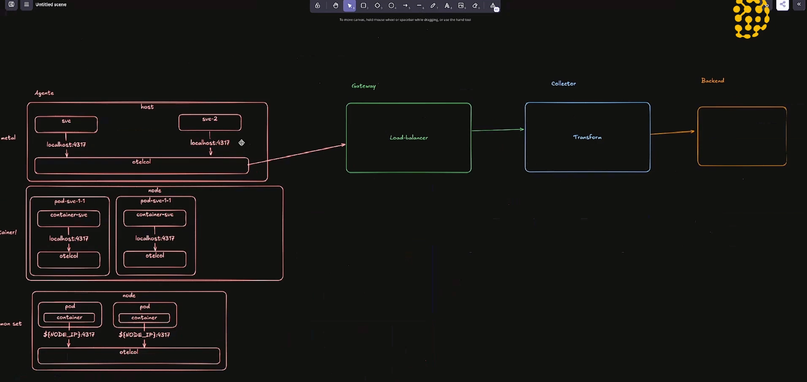

ou outro tipo de arquitetura

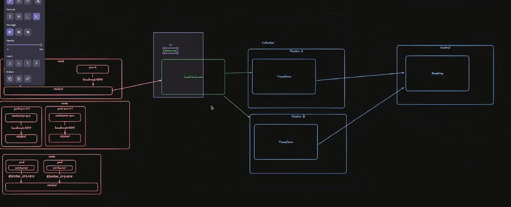

### Escalonando Collector

Nessa aula vamos falar sobre estratégias para escalonar coletores de telemetria de forma eficiente. Primeiro, abordamos como diferentes tipos de dados – logs, métricas e traces – exigem abordagens distintas. Logs, por exemplo, requerem escalonamento vertical, pois são coletados localmente em cada máquina, enquanto métricas e traces podem ser distribuídos horizontalmente. A forma de ingestão também impacta essa escolha: se os dados chegam via OTLP, podemos adicionar réplicas do coletor para lidar com a carga crescente.

Exploramos também o papel do Target Allocator no OpenTelemetry, um componente essencial para distribuir a carga entre os coletores. Ele garante que cada instância seja responsável por um subconjunto específico de métricas, evitando sobreposição e garantindo que cada série temporal seja única. O princípio do Single Writer é crucial aqui, pois evita que múltiplos coletores gravem os mesmos dados, prevenindo inconsistências.

Por fim, discutimos métricas de escalonamento automático, como o tamanho da fila de processamento e a saturação dos coletores. Uma boa prática é começar com três coletores e monitorar a carga, ajustando dinamicamente conforme necessário. Se a fila ultrapassa 60%, adicionamos mais coletores; se fica abaixo disso, reduzimos, sempre garantindo um mínimo operacional. Esse controle fino otimiza o consumo de recursos e a eficiência do sistema.

### Monitorando Collector

O conceito de filas é muito importante no collector, alguns spans podem falhar ao enviar dados pro backend, depois eles podem ser enviados novamente, mas depende você também pode alterar esse tipo de configuração. Além disso, caso você tenha uma fila muito grande pode ser que ela falhe também então o ideal é achar um número mágico que suporte as aplicações.

Nesta aula, eu mostrei como podemos monitorar o próprio OpenTelemetry Collector. Começamos configurando o Collector para que ele exporte dados de telemetria para um destino específico. Usei como base o repositório otel-call-cookbook, que traz receitas práticas de configuração. Nele, usamos um receiver que aceita protocolos GRPC e HTTP via OTLP, ouvindo nas portas 4317 e 4318. Esse receiver captura dados da aplicação em execução, mas nosso foco aqui não era a aplicação em si.

A parte realmente importante foi entender como coletar a telemetria gerada pelo próprio Collector. Para isso, configuramos três pipelines — uma para logs, outra para métricas e a terceira para rastreamentos — que usam um receiver OTLP e exportam os dados usando um debug exporter. Embora o exporter de debug não seja o mais usado em produção, ele nos serve bem para testes locais, pois permite inspecionar facilmente a saída diretamente no console.

A ideia principal foi mostrar como o próprio processo de observabilidade também pode — e deve — ser observado. Saber como o Collector se comporta nos dá visibilidade crítica sobre o que pode estar acontecendo com a instrumentação. Isso é essencial para quem trabalha com observabilidade em ambientes distribuídos e precisa garantir que tudo esteja fluindo como esperado.

Para essa parte dos estudos estamos usando este repo (https://github.com/jpkrohling/otelcol-cookbook)

Um exemplo de arquivo de configuração está em `simple2.yaml`

Caso você queira criar vários rastros é possivel digitar `telemetrygen traces --traces 1_000 --otlp-insecure`

É possivel visualizar as métricas através do:

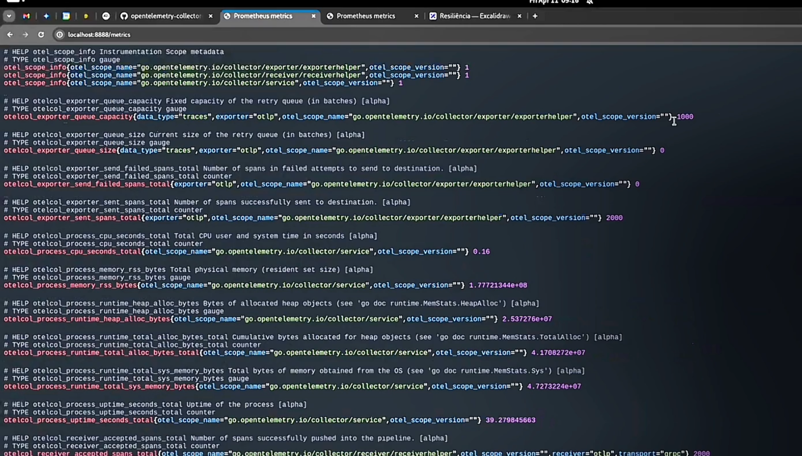

### Técnicas de Resiliência (É possivel fazer um armazenamento de fila em Disco)

Nesse módulo, eu aprofundei como podemos nos proteger contra falhas no collector agent, especificamente quando ele sai do ar. Comecei retomando o diagrama de arquitetura e relembrando a proteção já discutida em casos de falhas na comunicação entre o agent e o gateway. O foco, porém, foi mostrar o que acontece quando o agent propriamente dito falha — enquanto nosso serviço continua emitindo dados de telemetria. A principal preocupação aqui é evitar a perda de dados que estão em memória no momento da queda.

Para lidar com isso, mostrei como configurar o uso de file storage como técnica de persistência, usando extensões disponíveis no próprio collector. Isso permite que as filas de envio (Sending Queues) escrevam os dados temporários em disco. Na prática, a gente define o tipo de storage como file_storage, especifica o diretório e configura um timeout. Com isso, mesmo que o agent falhe, ao voltar ele consegue recuperar do disco os dados que estavam empilhados e enviá-los ao collector gateway, garantindo continuidade e confiabilidade no envio da telemetria.

Finalizei a aula com uma demonstração prática: simulei a queda do agent durante o envio de rastros e mostrei que, ao reiniciá-lo, ele recuperou os dados salvos em disco e os enviou corretamente ao backend. Foi tudo tão rápido que quase não conseguimos acompanhar as métricas, mas o resultado final confirmou que o mecanismo de persistência funcionou como esperado. Essa abordagem é essencial para ambientes de produção, onde perdas de dados podem comprometer análises e monitoramentos críticos.

### Técnicas de Resiliência - Mensageria

Neste terceiro vídeo da série sobre resiliência, aprofundei uma estratégia mais robusta para lidar com falhas entre collectors utilizando mensageria — mais especificamente, o Kafka. Expliquei como essa abordagem adiciona uma camada de resiliência crítica em arquiteturas cloud native. Em vez de confiar apenas na comunicação direta via OTLP, mostrei como inserir uma fila entre os agentes e o gateway pode ajudar a desacoplar os componentes e garantir continuidade na coleta de dados mesmo quando partes da arquitetura ficam temporariamente indisponíveis.

Mostrei o setup na prática, substituindo o envio direto de OTLP por mensagens enviadas a um tópico Kafka. Configurei o agente para publicar em um tópico otlp-span no Kafka (usando Docker em localhost:9092) e alterei o backend para consumir desse mesmo tópico com um KafkaReceiver. A grande sacada aqui foi utilizar o parâmetro initial_offset: earliest para garantir que nada se perca, mesmo quando o gateway estiver offline. Fiz testes enviando spans com o consumer desligado e, ao reativá-lo, todas as mensagens foram corretamente processadas — ou seja, a resiliência foi validada na prática.

Essa abordagem não elimina a necessidade de outros mecanismos como sending_queue em disco, mas ela expande bastante a robustez do sistema, especialmente quando lidamos com arquiteturas distribuídas e times que já dominam Kafka. Reforcei também que essa arquitetura pode ser aplicada tanto entre agente e gateway quanto entre gateway e backend de observabilidade. Ao final, validei a entrega completa dos dados mesmo após quedas simuladas, confirmando o valor do Kafka como buffer resiliente para pipelines de telemetria.

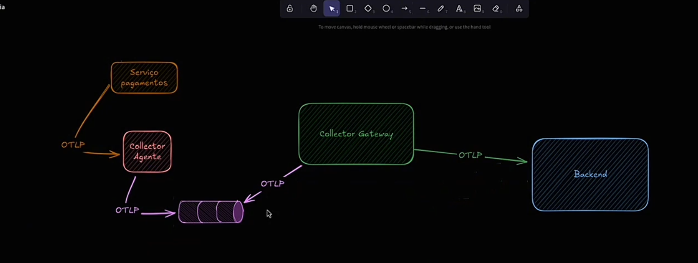

outro exemplo de arquivo yaml

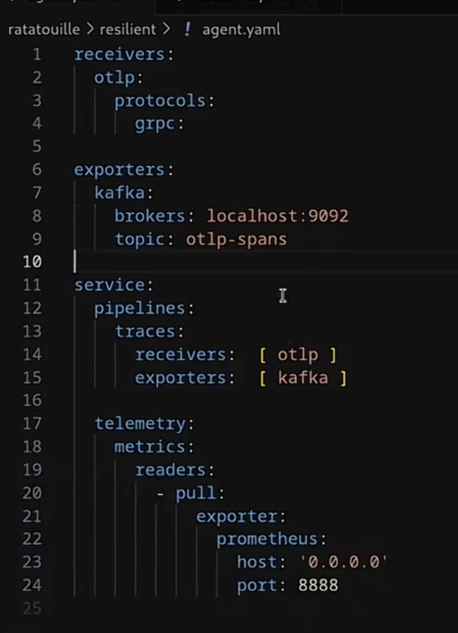

### Segurança - TLS

Nesta aula, você aprenderá a configurar o OpenTelemetry Collector para se comunicar utilizando TLS (Transport Layer Security). Vamos abordar os componentes essenciais do TLS, como a comunicação criptografada entre cliente e servidor, o papel do servidor ao oferecer um certificado TLS, e a eventual necessidade de um certificado de cliente para autenticação mútua.Exploraremos os três componentes chave do TLS: o certificado (arquivo .pem com informações do servidor e possivelmente do cliente), a chave privada (utilizada pelo servidor para decriptografar as informações) e, opcionalmente, a Certificate Authority (CA) (raiz de confiança para verificar a autenticidade dos certificados).Veremos como configurar o Collector com pipelines, demonstrando como receber informações tanto em texto plano quanto de forma criptografada via TLS. Através da configuração de receivers e exporters, entenderemos como aplicar as definições de TLS para garantir a segurança na transmissão dos seus dados de telemetria.Esta aula é fundamental para quem busca proteger a comunicação do seu OpenTelemetry Collector, garantindo a confidencialidade e integridade dos dados de observabilidade em seus ambientes

Ready to move on to the next Lesson?

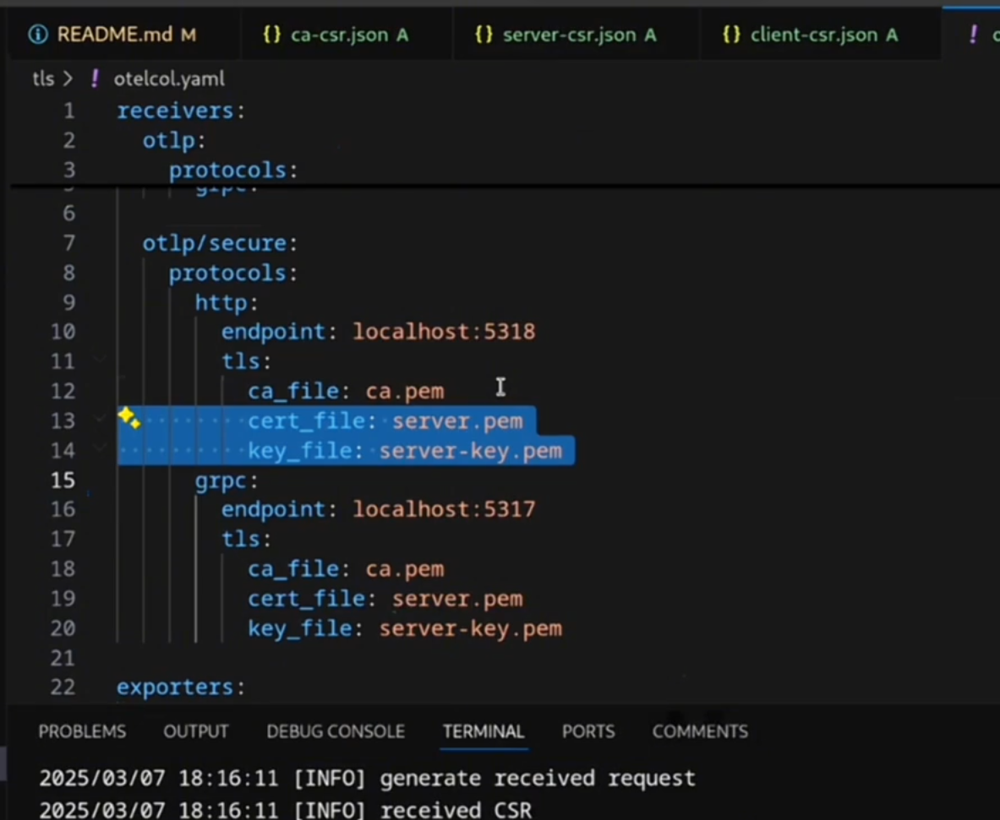
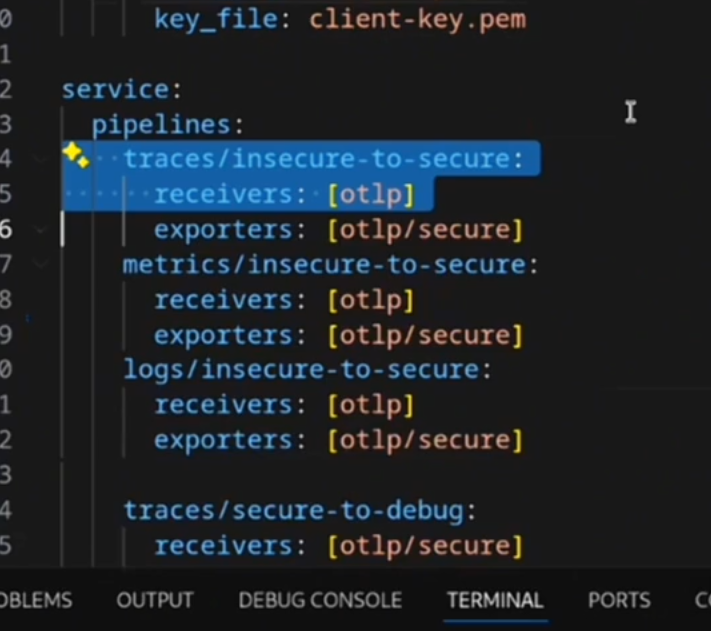

### Autenticação

É possivel usar um token do Keyclock por exemplo, para fazer a autenticação.
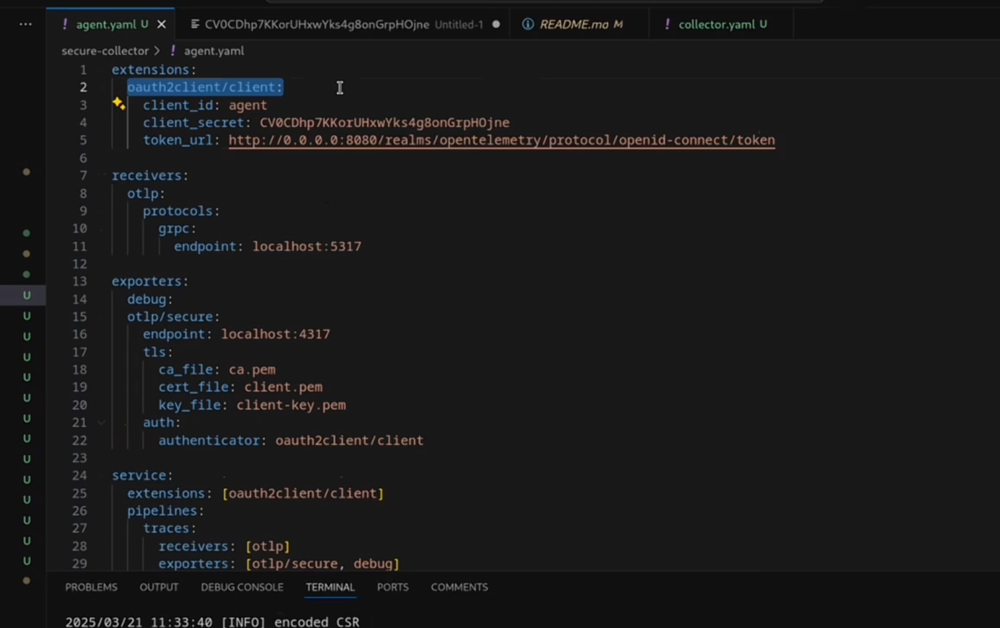

Um outro tipo de teste no arquivo collector

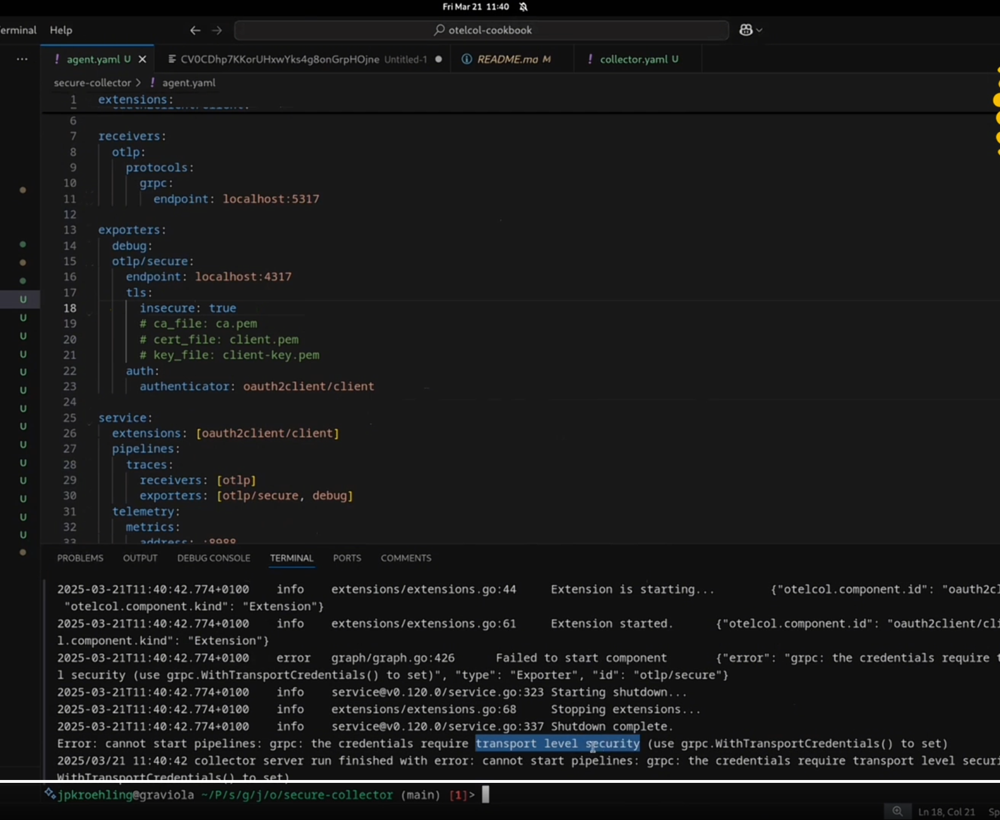

### Criação do seu OTLP Colector

Se você usar o otel-contrib você vai ter todas as extensões possiveis do otel, o seu binário também será maior, o que as vezes não é o melhor dos mundos pra você. Pode até alocar espaço na memória dependendo do caso.

Parar criar sua versão você pode ir até o otel-distributions no github (https://github.com/jpkrohling/otelcol-distributions) ou (https://github.com/open-telemetry/opentelemetry-collector-releases/tree/main/distributions)

e baixar o binário que você quer em `cmd/builder`

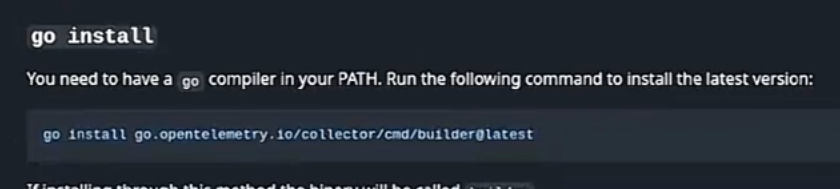

Para criar o arquivo de configuração primeiro você vai precisar criar o arquivo `manifest.yaml`, antes de criar o arquivo é bom se basear em algum arquivo de manifesto que já foi criado no Github. Depois de ajustar quais itens você quer basta: `ocb --config manifest.yaml`e depois vocÊ pode executar o collector `./_build/meucollector --config simple.yaml` por exemplo.

Precisa instalar o `ocb`:

```
### Listando todos os binários instalados

ls -la /root/go/bin/

## Instalando o ocb
go install go.opentelemetry.io/collector/cmd/builder@latest

## O binário vai se chamar builder
ls -la /root/go/bin/

## Como o alias esta se chamando builder possivel fazer o seguinte
sudo ln -s /root/go/bin/builder /usr/local/bin/ocb
echo 'alias ocb="builder"' >> ~/.bashrc
source ~/.bashrc

```

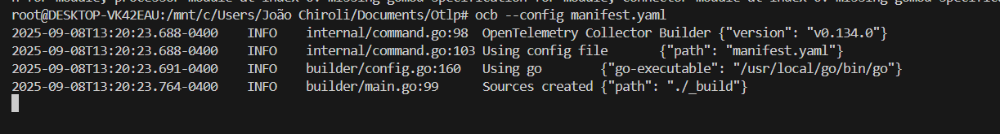

### Span Metrics

Nesta aula, eu apresento o conector Span Metrics, um componente poderoso do OpenTelemetry Collector projetado para derivar métricas de performance essenciais, como as métricas RED (Requisições, Erros, Duração), diretamente de dados de rastreamento distribuído. Eu começo com um resgate histórico, explicando que a funcionalidade nasceu no projeto Jaeger e evoluiu do antigo Span Metrics Processor para a arquitetura de Connector atual, que é mais robusta e eficiente.

O foco da aula é uma demonstração prática e detalhada. Eu mostro como configurar o coletor com uma pipeline para receber os rastros e outra para exportar as métricas geradas pelo conector para um backend como o Grafana. Para simular um tráfego realista, eu utilizo dados de exemplo da aplicação "Hotel Demo". Como resultado, nós visualizamos as métricas em tempo real em um dashboard que importamos, exibindo claramente a latência, a taxa de requisições e os erros por serviço.

Ao final, eu reforço o principal benefício do conector: a capacidade de obter insights valiosos sobre a saúde dos seus serviços sem precisar instrumentar o código da aplicação para gerar métricas, aproveitando apenas os traces que já existem. Eu também explico que o conector oferece vastas opções de configuração que permitem customizar dimensões, ajustar histogramas e filtrar atributos, garantindo que ele se adapte perfeitamente a qualquer sistema de backend.

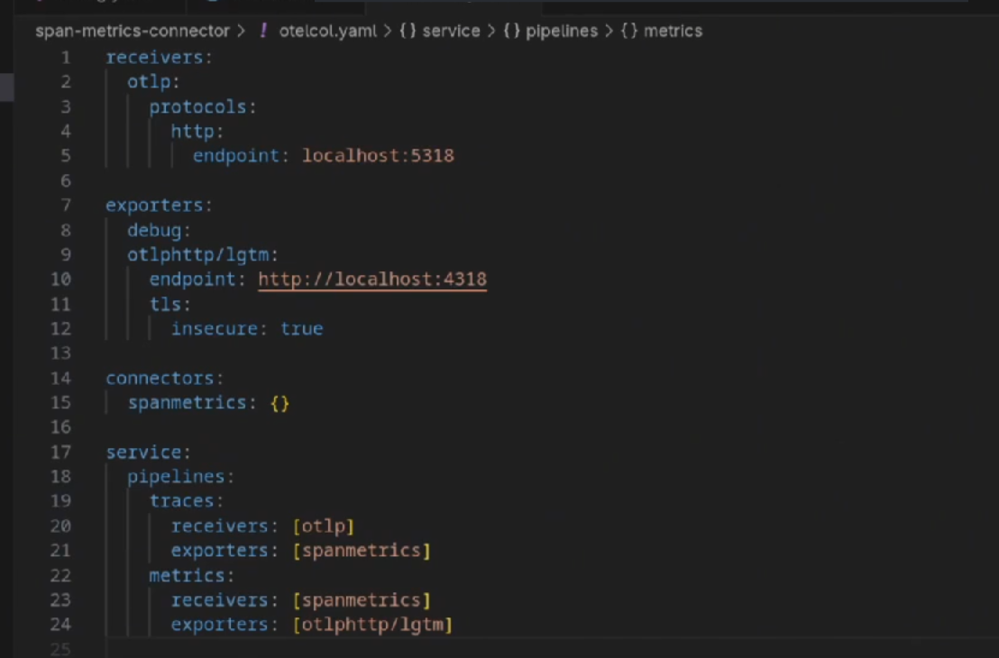

Link: https://github.com/open-telemetry/opentelemetry-collector-contrib/blob/main/connector/spanmetricsconnector/testdata/config.yaml
