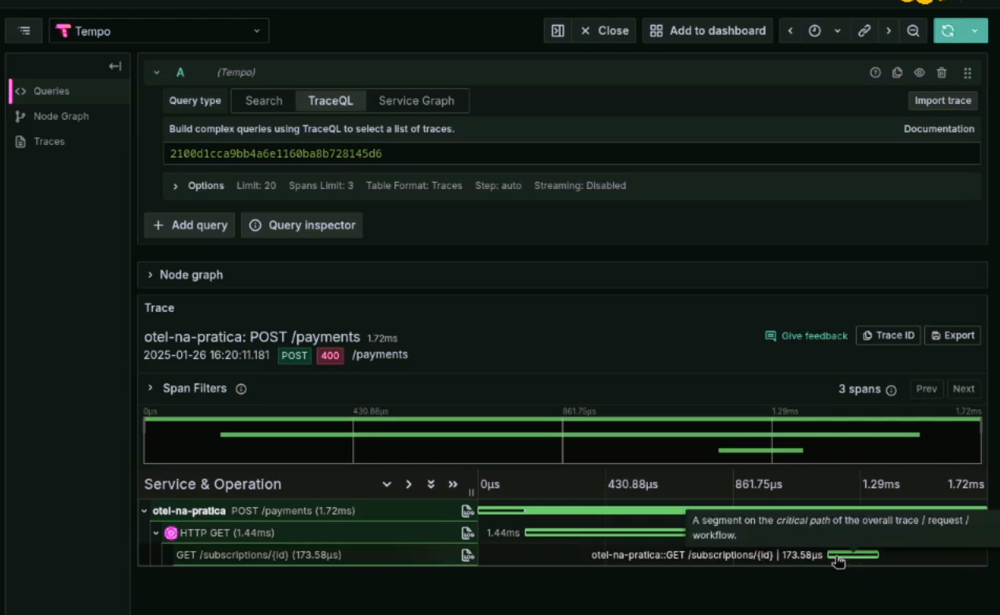
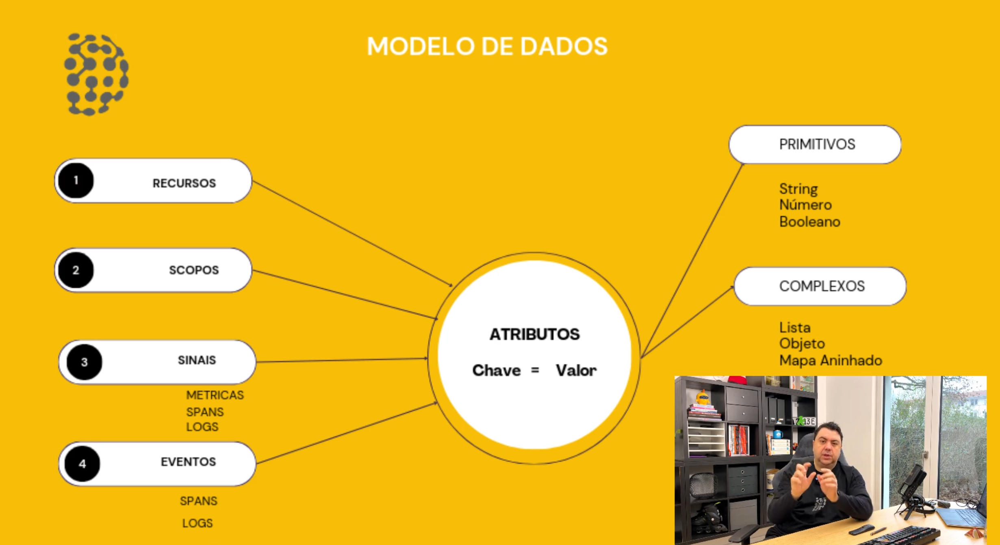

# Projeto OTel na Prática

Este é o projeto que utilizamos na Especialização em OpenTelemetry no [Dose de Telemetria](https://dosedetelemetria.com). Aqui temos uma aplicação relativamente simples, mas utilizando diversos aspectos de aplicações normais, como conexões HTTP e gRPC entre si, comunicação com banco de dados, envio e recebimento de mensagens via mensageria (message queue).

A aplicação não possui nenhuma instrumentação. Nada. Durante a especialização, vamos utilizar a aplicação para aprender diversos aspectos de observabilidade, com foco em OTel.

---

## **Sumário**

- [Módulos Disponíveis](#módulos-disponíveis)
- [Configuração](#configuração)
- [Como as coisas funcionam](#como-as-coisas-funcionam)
- [Contribuindo](#contribuindo)
- [Licença](#licença)

---

## Módulos Disponíveis

- **`cmd/users`**:

  - **Descrição**: Este módulo contém a aplicação principal para gerenciar usuários. Ele lida com operações como criação, atualização e exclusão de usuários.

- **`cmd/payments`**:

  - **Descrição**: Este módulo é responsável pelo processamento de pagamentos. Ele gerencia transações financeiras e integrações com gateways de pagamento. Ao receber uma requisição para um novo pagamento, coloca a requisição em uma fila de mensagens. Uma rotina na mesma aplicação recebe a mensagem e processa o pagamento, armazenando em um banco de dados SQLLite.

- **`cmd/all-in-one`**:

  - **Descrição**: Este módulo combina todas as funcionalidades em uma única aplicação. Ele é útil para desenvolvimento e testes locais, permitindo executar todos os serviços em um único processo.

- **`cmd/plans`**:

  - **Descrição**: Este módulo gerencia os planos de assinatura disponíveis. Ele lida com a criação, atualização e exclusão de planos. Aceita requisições tanto em HTTP quanto gRPC.

- **`cmd/subscriptions`**:
  - **Descrição**: Este módulo gerencia as assinaturas dos usuários aos planos. Ele lida com a criação, atualização e cancelamento de assinaturas.

---

## Configuração

Por padrão, um arquivo de configuração não é necessário, especialmente ao rodar o "all-in-one". Ao fazer a aplicação rodar separadamente, a maioria dos serviços vai precisar de um arquivo de configuração específico, que segue o seguinte formato:

```yaml
# yaml-language-server: $schema=./config-schema.yaml
payments:
  subscriptions_endpoint: http://localhost:8080/subscriptions
  sqlite:
    dsn: file::memory:?cache=shared
  nats:
    endpoint: nats://localhost:4222
    subject: payment.process
    stream: payments
    consumer_name: payments

subscriptions:
  users_endpoint: http://localhost:8080/users
  plans_endpoint: http://localhost:8080/plans

plans: {}

users: {}

server:
  endpoint:
    grpc: :8081
    http: :8080
```

---

## Como as coisas funcionam

- Os serviços "plans" e "users" não tem dependências com outros serviços. O serviço "subscriptions" precisa fazer conexões com "plans" e "users", enquanto que "payments" faz uma conexão com "subscriptions".

---

# Branchs importantes do projeto

- Primeira branch do projeto é a sdk-manual (https://github.com/dosedetelemetria/projeto-otel-na-pratica.git)
  - Através dessa branch vamos usar essa branch para concluir as aulas do módulo Otel na Prática

## Instalação das ferramentas

### NATS

Instalação do `nats-server` e `nats`

#### macOS via Homebrew

```
## nats-server
brew install nats-server

## NATS Command Line Interface
brew tap nats-io/nats-tools
brew install nats-io/nats-tools/nats
```

## Contribuindo

Quer ajudar a melhorar este projeto? Veja como começar no arquivo [CONTRIBUTING.md](CONTRIBUTING.md). O guia explica como criar Issues, enviar Pull Requests e seguir as melhores práticas para contribuir de forma eficiente.

---

## Licença

Este projeto está licenciado sob a licença Apache v2. Veja o arquivo [LICENSE](LICENSE) para mais detalhes.

# Passo a passo aula de sdk-manual

- Criar a repositório `/internal/telemetry` e depois criar o arquivo `/internal/telemetry/otel.go`
- Ir até o `cmd/main.go` e fazer a chamada para o opentelemetry funcionar, acrescentar o script abaixo no inicio do código:

  ```
  func main() {
    otelconfigFlag := flag.String("otel", "", "path to the config file")
    configFlag := flag.String("config", "", "path to the config file")
    flag.Parse()

    closer, err := telemetry.Setup(context.Background(), *otelConfigFlag)
    if err != nil {
      panic(err)
    }
    defer closer(context.Background())
    c, _ := config.LoadConfig(*configFlag)
  }
  ```

- Para fazer o programa funcionar é necessário executar primeiro `nats-server -D -js` em seguida baixe o nats cli `go install github.com/nats-io/natscli/nats@latest`, para identificar um serviço que esteja sendo executado na porta 4222 a mesma porta do nats-server use `sudo lsof -i :4222`
- Se tiver algum problema com o nats talvez seja necessário ajustar sua configuração do go:
  ```
  echo 'export PATH=$PATH:~/go/bin' >> ~/.bashrc
  source ~/.bashrc
  ```
- Executar `nats -s localhost:4222 stream create payments --subjects "payment.process" --storage memory --replicas 1 --retention=limits --discard=old --max-msgs 1_000_000 --max-msgs-per-subject 100_000 --max-bytes 4GiB --max-age 1d --max-msg-size 10MiB --dupe-window 2m --allow-rollup --no-deny-delete --no-deny-purge`, depois executar `otel-tui` e testar fazer o run `go run ./cmd/all-in-one/`
- Se quiser pode subir um docker com:
  ```
  Imagem do docker com Grafana, Tempo, Loki, OTLP Collector e Prometheus: `grafana/otel-lgtm`
  Comando pra inicializar: `docker run -p 3000:3000 -p 4317:4317 -p 4318:4318 --rm -ti grafana/otel-lgtm`
  ```
- Testar `curl localhost:8080/payments`
- Crie um arquivo na raiz do projeto `otel.yaml`

  ```
  file_format: "0.3"
  disabled: false
  resource:
    schema_url: https://opentelemetry.io/schemas/1.26.0
    attributes:
      - name: service.name
        value: "otel-na-pratica"
      - name: service.version
        value: "0.0.1"
      - name: environment
        value: "development"
      - name: distribution
        value: "all-in-one"
  propagator:
    composite: [ tracecontext, baggage ]
  tracer_provider:
    processors:
      - batch:
          exporter:
            otlp:
              protocol: grpc
              endpoint: http://localhost:4317

  meter_provider:
    readers:
      - periodic:
          interval: 1000
          exporter:
            otlp:
              protocol: http/protobuf
              endpoint: http://localhost:4318

  logger_provider:
    processors:
      - batch:
          exporter:
            otlp:
              protocol: http/protobuf
              endpoint: http://localhost:4318
  ```

- Instalar o otel-tui ferramenta que auxilia no processo de istrumentação da aplicação, por ela você consegue saber se os dados estão sendo enviados corretamente.
  ```
  go install github.com/ymtdzzz/otel-tui@latest
  ```
  Se der erro na instalação talvez seja necessário fazer:
  ```
  sudo apt update
  sudo apt install libx11-dev libxcursor-dev libxrandr-dev libxinerama-dev libxi-dev libxext-dev
  ```

## Latência entre serviços



Neste caso a requisição demorou 1.72ms. Ela fez um post, depois um get que demorou 1.44ms, esse Get abriu outro Get que demorou 173.58 micro segundos que devolveu o resultado pro Get anterior e depois pro Post.

### Conceitos teoricos a respeito do OTLP

- Atributos: conjunto de chave e valor. Deixar os valores o mais próximo dos tipos primitivos porque a maioria das ferramentas lidam melhor com os primitivos.



- Escopos: é um elemento fundamental para estruturar os dados de telemetria. Ele aparece em diferentes contextos, como spans, métricas e logs, servindo para identificar a origem da instrumentação.

- Recursos: são um conjunto de atributos que definem os metadados da aplicação. Exemplos: service-name, service-version.

- Contexto: é a informação passada entre serviços para manter a rastreabilidade de uma requisição, incluindo identificadores como trace ID e span ID.

- Bagagem: é um sinal no opentelemetry que é a transmissão de sinais entre dois serviços. É possivel colocar uma chave e valor no cabeçalho.

- Rastros: mapeamento do que aconteceu ao cruzar vários serviços.

- Métricas:

  - Estrutura Principal

    - MetricsData é o container principal que contém ResourceMetrics e ScopeMetrics
    - Cada nível tem seus próprios Attributes para metadados contextuais

  - Tipos de Métricas
    - Gauge: Valores instantâneos (ex: temperatura atual)
      - Contém pontos de dados normais (N. Data Point)
    - Sum: Valores acumulativos (ex: contador de requests)
      - Pode ser monotônico ou não
      - Contém pontos de dados normais
    - Histogram: Distribuição de valores em buckets
      - Inclui contadores de buckets, limites e quantis
      - Contém pontos de dados de histograma (H. Data Point)
  - Componentes dos Data Points
    - Attributes: Metadados do ponto
    - Time/Start time: Timestamps
    - Value: O valor da métrica
    - Exemplars: Exemplos de traces associados
  - Elementos Especiais
    - Buckets: Para histogramas (contadores e limites)
    - Summary: Agregação de dados com datapoint específico
    - Metadata (KV): Pares chave-valor para contexto adicional

- Logs: não é ponto forte do Opentelemetry, mas agora existe uma API de logs.

- Perfis: são criados através do eBPF Profiler. OpenTelemetry e ainda está em desenvolvimento, sem suporte completo nas SDKs ou no Collector. Apesar de novo, o sinal de perfis já possui um modelo bem estruturado, incluindo resource profiles e scope profiles, que definem a instrumentação e agrupam os perfis coletados.

- Entidades: um novo conjunto de propriedaes que ainda está em debate. Que serve para mostrar para você de forma não ambigua qual é sua fonte de telemetria. Porque com muitos dados pode ser que apareçam nomes iguais.

# OpenTelemetry API

Podemos dizer que a API é como a interface de um motor de carro (o volante, o pedal do acelerador, o painel). Você sabe como usá-la para dirigir, mas ela não é o motor em si.

Fluxo de Dados (Como eles trabalham juntos)
Seu código da aplicação -> API -> SDK -> Processadores -> Exportadores -> Backend (Jaeger, Zipkin, etc.)

1. Seu código chama a API: span = tracer.spanBuilder("operacao").startSpan()

2. A API delega a criação do span para a implementação do SDK configurada.

3. O SDK cria um objeto Span, gerencia seu ciclo de vida e o contexto.

4. Quando o span é finalizado (span.end()), o SDK o entrega para os Processadores configurados.

5. Os Processadores fazem seu trabalho (ex.: amostragem) e passam o span para os Exportadores.

6. Os Exportadores convertem o span no formato adequado e o enviam para o backend configurado.

## Audiência

Existe uma API de opentelemetry para cada linguagem de programação, ou seja, existe uma API para Go, uma API para JAVA, uma API para Python, etc.

Existe uma especificação que deve ser seguida em cada uma das linguagens mencionadas acima.

Nesta aula, mergulhamos nas diferentes audiências da OpenTelemetry API e como ela é implementada para cada linguagem de programação, como Go e Java. Discutimos a importância de seguir a especificação da API para garantir consistência, independentemente da linguagem escolhida.

Identificamos três grupos principais que utilizam a API: **desenvolvedores de software, engenheiros de SRE e criadores de bibliotecas ou frameworks**. Cada grupo tem suas necessidades específicas, mas todos compartilham o objetivo de tornar suas aplicações mais observáveis e resilientes.

Além disso, abordamos as diferenças entre instrumentação para rastros e métricas, destacando a flexibilidade do OpenTelemetry para diferentes casos de uso. Entenda como aplicar esses conceitos para desenvolver sistemas mais confiáveis e alinhados às melhores práticas do mercado.

## Rastreamento distribuido

Existem algumas funções que podem ser adicionadas para melhorar o rastreamento da sua aplicação como:

- Span Add Link
- Trace Span Kind

Imagem do docker com Grafana, Tempo, Loki, OTLP Collector e Prometheus: `grafana/otel-lgtm`

Comando pra inicializar: `docker run -p 3000:3000 -p 4317:4317 -p 4318:4318 --rm -ti grafana/otel-lgtm`

# OTLP SDK

Apresentei os três tipos principais de providers: TracerProvider para rastreamento, MeterProvider para métricas e LoggerProvider para logs. Cada um deles serve como uma "receita" para criar objetos responsáveis por coletar sinais. Para rastreamento, por exemplo, é comum configurar processadores como o batch processor, exportadores como OTLP ou Jaeger, e definir estratégias de amostragem. No caso de métricas, além de processadores e exportadores, entra em cena o componente exclusivo chamado reader, que será abordado mais a fundo em seu módulo específico.

Também destaquei a importância dos resource attributes. Esses atributos são compartilhados entre todos os sinais e ajudam a correlacionar logs, métricas e rastros de uma mesma instância.

## Rastreamento Distribuido

Esse é o ponto central da configuração, onde definimos processadores e amostradores. Foram apresentados diferentes tipos de samplers, como o AlwaysOn, que registra todos os spans, e o AlwaysOff, que descarta todos. Também incluí opções mais sofisticadas, como o ParentBased, o TraceIDRatioBased e o Jaeger Remote Sampler, que usa arquivos JSON remotos para determinar estratégias de amostragem.

Expliquei como funcionam as decisões de amostragem baseadas no contexto propagado entre serviços. Por exemplo, o ParentBased respeita a decisão tomada pelo span pai, garantindo consistência ao longo da cadeia de rastreamento. É possível combinar estratégias: quando não há contexto anterior, pode-se recorrer ao TraceIDRatioBased para aplicar uma amostragem probabilística.

## Métricas

No código, configurei o MetricProvider com um PeriodicReader e um Exporter via OTLP HTTP, garantindo que as métricas sejam exportadas em intervalos regulares. Usei os mesmos atributos de recurso que foram definidos anteriormente para rastros, garantindo consistência entre os sinais.

## Logs

A configuração abordada foi apenas da SDK de logs — não entramos na LogBridge diretamente. Expliquei que mesmo que tecnicamente possamos ter múltiplos LoggerProviders (LPs), o registro é feito globalmente com global.setLogProvider, o que centraliza o fornecimento de loggers na aplicação. Essa abordagem facilita a configuração, mas exige atenção à forma como esse provider é estruturado. No código, construímos o LoggerProvider de forma semelhante ao que fizemos anteriormente para traces e métricas, adicionando o recurso de batch processing e configurando o exportador (LXP) para envio via OTLP HTTP, utilizando o endpoint /v1/logs.

## Usando Arquivo de Configuração

Nesta aula, eu mostrei uma alternativa à configuração programática ou via variáveis de ambiente: o uso de arquivos de configuração para inicializar a SDK do OpenTelemetry. Nas aulas anteriores, usamos muito código para configurar rastros, métricas e logs. Isso é flexível, mas pouco prático em cenários maiores ou quando se deseja reaproveitar configurações. Com os arquivos, conseguimos centralizar e simplificar essas definições, mantendo compatibilidade com múltiplas linguagens, como Go, Java e PHP. A especificação do formato é definida pela SIG Configuration, o que garante padronização.

No exemplo com Go, usamos uma flag para apontar o caminho do arquivo YAML de configuração. A partir disso, criamos uma função que lê esse arquivo, interpola variáveis de ambiente e gera objetos Go para configurar a SDK. Em poucas linhas conseguimos aplicar toda a configuração, comparando com as dezenas de linhas necessárias no modelo programático. Apesar de pequenos bugs na propagação, que ainda exigem um ajuste manual, o ganho de simplicidade e legibilidade é muito evidente.

A maior vantagem desse modelo é a flexibilidade: conseguimos, por exemplo, configurar múltiplos processors ou exporters (como enviar dados simultaneamente por HTTP e gRPC) sem modificar o código da aplicação. Em ambientes legados, isso evita recompilações, PRs e deploys demorados. Basta editar o arquivo de configuração e reiniciar o serviço. Com isso, encerramos o módulo sobre configuração da SDK, destacando como o uso de arquivos traz mais controle e agilidade para o time de engenharia.
