# OpenTelemetry Collector Contrib Distro

This distribution contains all the components from both the [OpenTelemetry Collector](https://github.com/open-telemetry/opentelemetry-collector) repository and the [OpenTelemetry Collector Contrib](https://github.com/open-telemetry/opentelemetry-collector-contrib) repository. This distribution includes open source and vendor supported components.

## Recommendation

As this distribution contains many components, it is a good starting point to try various configurations. However, when running in production, it is recommended to limit the collector to contain only the components necessary for an environment. Some reasons to do this:

- reduce the size of the collector, reducing deployment times for the collector
- improve the security of the collector by reducing the available attack surface area

Building a [custom collector](https://opentelemetry.io/docs/collector/custom-collector/) can be achieved using the [OpenTelemetry Collector Builder](https://github.com/open-telemetry/opentelemetry-collector/tree/main/cmd/builder).

## Components

The full list of components is available in the [manifest](manifest.yaml)

### Rules for Component Inclusion

- Include all extensions at [Alpha stability](https://github.com/open-telemetry/opentelemetry-collector#alpha) or higher and pipeline components that have at least 1 signal at [Alpha stability](https://github.com/open-telemetry/opentelemetry-collector#alpha) or higher.

Eu posso baixar o otel na versão desejada se eu quiser por exemplo:

```
wget https://github.com/open-telemetry/opentelemetry-collector-releases/releases/download/v0.120.0/otelcol-contrib_0.120.0_linux_amd64.tar.gz

## Descompactar o arquivo
tar xzf otelcol-contrib_0.120.0_linux_amd64.tar.gz

## Executar o binário
./otelcol-contrib

## Mover o binário do otel-contrib para o diretório /bin
 mv otelcol-contrib /bin/ ou mv otelcol-contrib ~/bin/

## Eu posso testar usando o comando a seguir, passando o arquivo de configuração
otelcol-contrib --config simple.yaml

## Depois você pode executar um comando qualquer em outro cmd pra ver os dados chegando no seu colector
go run ./

ou

go run ./cmd/all-in-one/
```

### Agent vs Gateways vs Coletores

**OpenTelemetry Agent**
O Agent é um componente que roda como um processo separado no mesmo host da aplicação:
Características:

Executa como sidecar ou daemon no nó/container
Coleta telemetria localmente da aplicação
Baixa latência entre app e agent
Processamento local dos dados

- Vantagens:

  - Menor impacto na aplicação (offloading de processamento)
  - Resiliência local (buffer local caso backend falhe)
  - Configuração centralizada por nó

- Desvantagens:

  - Overhead de recursos por nó
  - Gerenciamento de configuração distribuído

**OpenTelemetry Gateway**
O Gateway é um componente centralizado que atua como proxy entre múltiplas fontes e backends:
Características:

Instância centralizada recebendo de múltiplos agents/apps
Agregação e roteamento de telemetria
Ponto único de controle e política
Load balancing para backends

- Vantagens:

  - Redução de conexões diretas aos backends
  - Controle centralizado de políticas
  - Agregação e correlação de dados
  - Economia de recursos em escala

- Desvantagens:

  - Ponto único de falha (precisa ser redundante)
  - Maior latência na pipeline

**OpenTelemetry Collector**
O Collector é o componente core que pode funcionar tanto como Agent quanto Gateway:

Arquitetura:
Receivers → Processors → Exporters
Receivers: Coletam dados (OTLP, Jaeger, Zipkin, Prometheus)
Processors: Transformam/filtram dados (sampling, batching)
Exporters: Enviam para backends (Jaeger, Prometheus, ELK)
Padrões de Deployment

1. Agent Pattern
   App → OTel Collector (Agent) → Backend
2. Gateway Pattern
   App → OTel Collector (Agent) → OTel Collector (Gateway) → Backend
3. Direct Pattern
   App → Backend (usando SDK direto)
   Quando usar cada um?
   Use Agent quando:

Aplicações em containers/K8s
Necessita processamento local
Quer desacoplar app do backend

Use Gateway quando:

Ambiente multi-tenant
Necessita controle centralizado
Muitas aplicações → poucos backends

Use Collector quando:

Necessita flexibilidade (pode ser agent ou gateway)
Quer pipeline configurável
Padrão vendor-neutral


ou outro tipo de arquitetura


### Escalonando Collector

Nessa aula vamos falar sobre estratégias para escalonar coletores de telemetria de forma eficiente. Primeiro, abordamos como diferentes tipos de dados – logs, métricas e traces – exigem abordagens distintas. Logs, por exemplo, requerem escalonamento vertical, pois são coletados localmente em cada máquina, enquanto métricas e traces podem ser distribuídos horizontalmente. A forma de ingestão também impacta essa escolha: se os dados chegam via OTLP, podemos adicionar réplicas do coletor para lidar com a carga crescente.

Exploramos também o papel do Target Allocator no OpenTelemetry, um componente essencial para distribuir a carga entre os coletores. Ele garante que cada instância seja responsável por um subconjunto específico de métricas, evitando sobreposição e garantindo que cada série temporal seja única. O princípio do Single Writer é crucial aqui, pois evita que múltiplos coletores gravem os mesmos dados, prevenindo inconsistências.

Por fim, discutimos métricas de escalonamento automático, como o tamanho da fila de processamento e a saturação dos coletores. Uma boa prática é começar com três coletores e monitorar a carga, ajustando dinamicamente conforme necessário. Se a fila ultrapassa 60%, adicionamos mais coletores; se fica abaixo disso, reduzimos, sempre garantindo um mínimo operacional. Esse controle fino otimiza o consumo de recursos e a eficiência do sistema.

### Monitorando Collector

O conceito de filas é muito importante no collector, alguns spans podem falhar ao enviar dados pro backend, depois eles podem ser enviados novamente, mas depende você também pode alterar esse tipo de configuração. Além disso, caso você tenha uma fila muito grande pode ser que ela falhe também então o ideal é achar um número mágico que suporte as aplicações.

Nesta aula, eu mostrei como podemos monitorar o próprio OpenTelemetry Collector. Começamos configurando o Collector para que ele exporte dados de telemetria para um destino específico. Usei como base o repositório otel-call-cookbook, que traz receitas práticas de configuração. Nele, usamos um receiver que aceita protocolos GRPC e HTTP via OTLP, ouvindo nas portas 4317 e 4318. Esse receiver captura dados da aplicação em execução, mas nosso foco aqui não era a aplicação em si.

A parte realmente importante foi entender como coletar a telemetria gerada pelo próprio Collector. Para isso, configuramos três pipelines — uma para logs, outra para métricas e a terceira para rastreamentos — que usam um receiver OTLP e exportam os dados usando um debug exporter. Embora o exporter de debug não seja o mais usado em produção, ele nos serve bem para testes locais, pois permite inspecionar facilmente a saída diretamente no console.

A ideia principal foi mostrar como o próprio processo de observabilidade também pode — e deve — ser observado. Saber como o Collector se comporta nos dá visibilidade crítica sobre o que pode estar acontecendo com a instrumentação. Isso é essencial para quem trabalha com observabilidade em ambientes distribuídos e precisa garantir que tudo esteja fluindo como esperado.

Para essa parte dos estudos estamos usando este repo (https://github.com/jpkrohling/otelcol-cookbook)

Um exemplo de arquivo de configuração está em `simple2.yaml`

Caso você queira criar vários rastros é possivel digitar `telemetrygen traces --traces 1_000 --otlp-insecure`

É possivel visualizar as métricas através do:


### OTTL

Nesta aula, aprofundamos na OTTL (OpenTelemetry Transformation Language). Apresentamos a OTTL como uma DSL (Domain-Specific Language) poderosa, projetada para operar exclusivamente dentro do Collector do OpenTelemetry. Seu principal objetivo é permitir a manipulação e transformação de dados de telemetria — traces, métricas e logs — em tempo real, à medida que passam pela sua pipeline, garantindo que cheguem ao destino final no formato e com o conteúdo desejado.

Analisamos a estrutura fundamental de uma declaração OTTL, que combina funções com condicionais. Distinguimos os dois tipos de funções: as Editoras (set, delete_key), que modificam os dados diretamente no local, e as Conversoras (ToUpper), que recebem um valor, o transformam e retornam um novo resultado. Explicamos como usar "paths" para acessar atributos específicos e a cláusula where para aplicar lógica condicional, controlando com precisão quando uma transformação deve ocorrer.

Através de exemplos práticos, demonstramos o poder da OTTL para resolver problemas do mundo real. Vimos como normalizar dados, convertendo o método HTTP para maiúsculas em um trace, e como garantir a segurança removendo um campo de senha de um registro de log. Concluímos que dominar a OTTL é essencial para quem gerencia pipelines de telemetria, oferecendo um controle granular para limpar, enriquecer e proteger seus dados.

Você possui funções editoras e conversoras.

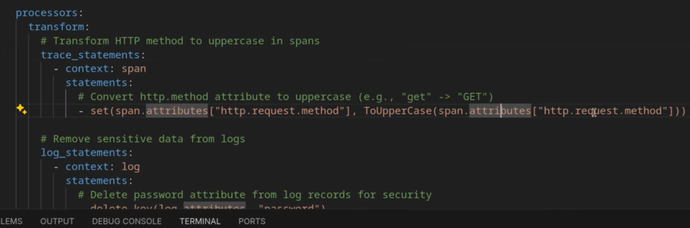

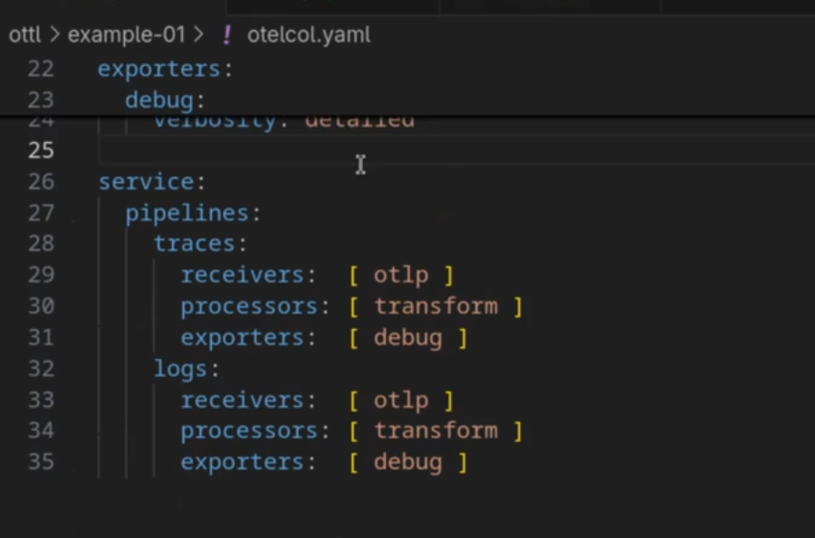

### Técnicas de Resiliência (É possivel fazer um armazenamento de fila em Disco)

Nesse módulo, eu aprofundei como podemos nos proteger contra falhas no collector agent, especificamente quando ele sai do ar. Comecei retomando o diagrama de arquitetura e relembrando a proteção já discutida em casos de falhas na comunicação entre o agent e o gateway. O foco, porém, foi mostrar o que acontece quando o agent propriamente dito falha — enquanto nosso serviço continua emitindo dados de telemetria. A principal preocupação aqui é evitar a perda de dados que estão em memória no momento da queda.

Para lidar com isso, mostrei como configurar o uso de file storage como técnica de persistência, usando extensões disponíveis no próprio collector. Isso permite que as filas de envio (Sending Queues) escrevam os dados temporários em disco. Na prática, a gente define o tipo de storage como file_storage, especifica o diretório e configura um timeout. Com isso, mesmo que o agent falhe, ao voltar ele consegue recuperar do disco os dados que estavam empilhados e enviá-los ao collector gateway, garantindo continuidade e confiabilidade no envio da telemetria.

Finalizei a aula com uma demonstração prática: simulei a queda do agent durante o envio de rastros e mostrei que, ao reiniciá-lo, ele recuperou os dados salvos em disco e os enviou corretamente ao backend. Foi tudo tão rápido que quase não conseguimos acompanhar as métricas, mas o resultado final confirmou que o mecanismo de persistência funcionou como esperado. Essa abordagem é essencial para ambientes de produção, onde perdas de dados podem comprometer análises e monitoramentos críticos.

### Técnicas de Resiliência - Mensageria

Neste terceiro vídeo da série sobre resiliência, aprofundei uma estratégia mais robusta para lidar com falhas entre collectors utilizando mensageria — mais especificamente, o Kafka. Expliquei como essa abordagem adiciona uma camada de resiliência crítica em arquiteturas cloud native. Em vez de confiar apenas na comunicação direta via OTLP, mostrei como inserir uma fila entre os agentes e o gateway pode ajudar a desacoplar os componentes e garantir continuidade na coleta de dados mesmo quando partes da arquitetura ficam temporariamente indisponíveis.

Mostrei o setup na prática, substituindo o envio direto de OTLP por mensagens enviadas a um tópico Kafka. Configurei o agente para publicar em um tópico otlp-span no Kafka (usando Docker em localhost:9092) e alterei o backend para consumir desse mesmo tópico com um KafkaReceiver. A grande sacada aqui foi utilizar o parâmetro initial_offset: earliest para garantir que nada se perca, mesmo quando o gateway estiver offline. Fiz testes enviando spans com o consumer desligado e, ao reativá-lo, todas as mensagens foram corretamente processadas — ou seja, a resiliência foi validada na prática.

Essa abordagem não elimina a necessidade de outros mecanismos como sending_queue em disco, mas ela expande bastante a robustez do sistema, especialmente quando lidamos com arquiteturas distribuídas e times que já dominam Kafka. Reforcei também que essa arquitetura pode ser aplicada tanto entre agente e gateway quanto entre gateway e backend de observabilidade. Ao final, validei a entrega completa dos dados mesmo após quedas simuladas, confirmando o valor do Kafka como buffer resiliente para pipelines de telemetria.


outro exemplo de arquivo yaml


### Segurança - TLS

Nesta aula, você aprenderá a configurar o OpenTelemetry Collector para se comunicar utilizando TLS (Transport Layer Security). Vamos abordar os componentes essenciais do TLS, como a comunicação criptografada entre cliente e servidor, o papel do servidor ao oferecer um certificado TLS, e a eventual necessidade de um certificado de cliente para autenticação mútua.Exploraremos os três componentes chave do TLS: o certificado (arquivo .pem com informações do servidor e possivelmente do cliente), a chave privada (utilizada pelo servidor para decriptografar as informações) e, opcionalmente, a Certificate Authority (CA) (raiz de confiança para verificar a autenticidade dos certificados).Veremos como configurar o Collector com pipelines, demonstrando como receber informações tanto em texto plano quanto de forma criptografada via TLS. Através da configuração de receivers e exporters, entenderemos como aplicar as definições de TLS para garantir a segurança na transmissão dos seus dados de telemetria.Esta aula é fundamental para quem busca proteger a comunicação do seu OpenTelemetry Collector, garantindo a confidencialidade e integridade dos dados de observabilidade em seus ambientes

Ready to move on to the next Lesson?


### Autenticação

É possivel usar um token do Keyclock por exemplo, para fazer a autenticação.


Um outro tipo de teste no arquivo collector


### Criação do seu OTLP Colector

Se você usar o otel-contrib você vai ter todas as extensões possiveis do otel, o seu binário também será maior, o que as vezes não é o melhor dos mundos pra você. Pode até alocar espaço na memória dependendo do caso.

Parar criar sua versão você pode ir até o otel-distributions no github (https://github.com/jpkrohling/otelcol-distributions) ou (https://github.com/open-telemetry/opentelemetry-collector-releases/tree/main/distributions)

e baixar o binário que você quer em `cmd/builder`


Para criar o arquivo de configuração primeiro você vai precisar criar o arquivo `manifest.yaml`, antes de criar o arquivo é bom se basear em algum arquivo de manifesto que já foi criado no Github. Depois de ajustar quais itens você quer basta: `ocb --config manifest.yaml`e depois vocÊ pode executar o collector `./_build/meucollector --config simple.yaml` por exemplo.

Precisa instalar o `ocb`:

```
### Listando todos os binários instalados

ls -la /root/go/bin/

## Instalando o ocb
go install go.opentelemetry.io/collector/cmd/builder@latest

## O binário vai se chamar builder
ls -la /root/go/bin/

## Como o alias esta se chamando builder possivel fazer o seguinte
sudo ln -s /root/go/bin/builder /usr/local/bin/ocb
echo 'alias ocb="builder"' >> ~/.bashrc
source ~/.bashrc

```


### Span Metrics

Usado para coletar dados de métricas através do rastreamento distribuido, ou seja, se você instrumentou a aplicação para traces a partir dai essa funcionalidade permite que você tenha dados de métricas.

Nesta aula, eu apresento o conector Span Metrics, um componente poderoso do OpenTelemetry Collector projetado para derivar métricas de performance essenciais, como as métricas RED (Requisições, Erros, Duração), diretamente de dados de rastreamento distribuído. Eu começo com um resgate histórico, explicando que a funcionalidade nasceu no projeto Jaeger e evoluiu do antigo Span Metrics Processor para a arquitetura de Connector atual, que é mais robusta e eficiente.

O foco da aula é uma demonstração prática e detalhada. Eu mostro como configurar o coletor com uma pipeline para receber os rastros e outra para exportar as métricas geradas pelo conector para um backend como o Grafana. Para simular um tráfego realista, eu utilizo dados de exemplo da aplicação "Hotel Demo". Como resultado, nós visualizamos as métricas em tempo real em um dashboard que importamos, exibindo claramente a latência, a taxa de requisições e os erros por serviço.

Ao final, eu reforço o principal benefício do conector: a capacidade de obter insights valiosos sobre a saúde dos seus serviços sem precisar instrumentar o código da aplicação para gerar métricas, aproveitando apenas os traces que já existem. Eu também explico que o conector oferece vastas opções de configuração que permitem customizar dimensões, ajustar histogramas e filtrar atributos, garantindo que ele se adapte perfeitamente a qualquer sistema de backend.


Link: https://github.com/open-telemetry/opentelemetry-collector-contrib/blob/main/connector/spanmetricsconnector/testdata/config.yaml

# Extendendo o Collector

### Extensions

Hoje eu mostrei como criar uma extension personalizada para o OpenTelemetry Collector, explicando o papel que essas extensões exercem na arquitetura: elas permitem adicionar funcionalidades ao Collector sem impactar diretamente a pipeline de dados. Começamos revisando o conceito e partimos para a criação de uma nova distribuição, onde definimos os arquivos manifest.yaml e otel.yaml para estruturar nosso ambiente. Já de início, montamos a configuração do Collector pensando nos componentes necessários e como a extension seria integrada.

Em seguida, criei a estrutura da extensão com os arquivos essenciais: configuração, factory.go e a própria lógica da extension. Mostrei como o Collector consome essas definições através do main.go, que monta os componentes a partir do builder. Implementamos a interface obrigatória com os métodos Start e Shutdown, além de uma configuração padrão com a URL, que pode ser sobrescrita no YAML. Reforcei a importância de entender essa integração, especialmente quando o código é externo ao repositório oficial do projeto.

Por fim, compilei a nova distribuição, corrigi pequenos bugs (como o uso de letras maiúsculas em campos exportados) e validei que o Collector inicializa corretamente, utilizando tanto o valor padrão da URL quanto o valor sobrescrito. Esse processo serve como base para o desenvolvimento de novos componentes e módulos. A ideia é que agora, com esse conhecimento, seja mais fácil construir funcionalidades mais avançadas e reaproveitar essa estrutura nos próximos vídeos.

Depois de criado os arquivos, é necessário ir até o arquivo extension e executar: `go mod init github.com/joaochiroli/projeto-otel-na-pratica/extensions/myextension` e depois `go mod tidy`

Fazer o comando `ocb --config manifest.yaml` para compilar

Para testar podemos `./dist/otel-na-pratica --config otel.yaml`

### Receivers

Na criação dos receivers a ideia é a mesma que foi implementada, o que muda é que não será usado `extension.Factory` e sim `receiver.Factory`
no arquivo de configuração `factory.go`

Neste vídeo, mostrei como criar um receiver customizado para o OpenTelemetry Collector. Partimos da estrutura já familiar do módulo de extensions, reaproveitando conceitos e formato de código. A factory do receiver retorna uma receiver.Factory e usamos o receiver.WithTraces para configurar qual função vai lidar com os traces recebidos. Essa função é essencial pois é ela que liga o receiver com o restante da pipeline via a interface Next, que representa o próximo consumidor dos dados, seja um processor ou um exporter.

A implementação central do receiver inclui a estrutura do componente, o start, o shutdown e a função ConsumeTraces. Mostrei como o receiver é registrado na configuração do Collector e como, mesmo sem dados reais, podemos criar um mock que gera pacotes de telemetria a cada segundo usando ticker. Isso permite simular o comportamento de um receiver real, que normalmente escutaria uma porta de rede ou buscaria dados de algum sistema.

No trecho mais prático, implementamos um loop que cria rastros periodicamente e os envia via next.ConsumeTraces, validando a estrutura gerada tanto no log do próprio receiver quanto no debug exporter. Essa simulação comprova que nosso receiver está funcional e integrado corretamente na pipeline do Collector. Toda a lógica pode ser adaptada posteriormente para refletir fontes reais de dados observáveis.

### Processor

Neste módulo, aprofundei o papel do processor no OpenTelemetry Collector. Ele atua entre o receiver e o exporter, podendo modificar os dados que trafegam na pipeline. Quando não altera os dados, é importante deixar isso claro para o Collector, permitindo paralelização segura no futuro. Esse cuidado é essencial especialmente quando manipulamos dados sensíveis, como PII. Ressaltei também que este conteúdo se apoia nos vídeos anteriores sobre receiver e extension, e recomendo fortemente assisti-los primeiro para melhor entendimento.

Na parte prática, mostrei como configurar um novo processador, criando o componente na pasta processors/myprocessor e adicionando no manifesto. Utilizei a função createTraces para inicializar o processor e definimos capacidades com Capabilities, que indicam se há ou não alteração dos dados. Implementamos a interface ConsumerTraces, onde a lógica de negócio é concentrada na função ConsumeTraces. Essa função é o coração do processador, manipulando os rastros recebidos e repassando-os ao próximo componente.

No final, simulei a adição de atributos a um span para demonstrar como o processador pode enriquecer os rastros. Fizemos isso criando novos spans e adicionando atributos como "MyProcessor passou por aqui". Essa manipulação deixou claro o fluxo entre receiver e processor, demonstrando como os dados são criados e modificados ao longo da pipeline. Isso fecha um ciclo didático prático sobre criação e uso de processors no OpenTelemetry.

### Exporter

Nesta aula, eu explorei o funcionamento do componente exporter dentro do pipeline do OpenTelemetry. Diferente dos receivers e processors, o exporter é o estágio final da cadeia e não possui um next para onde passar os dados. Ele é responsável por consumir os dados e exportá-los para fora do sistema — seja via HTTP, RPC ou outros meios. Com isso, a estrutura muda levemente, embora ainda siga a interface Consumer.

Implementei um exemplo funcional do myExporter, onde mostramos como configurar e estruturar o componente, definindo suas funções como start, shutdown, capabilities e consumeTraces. No consumeTraces, modifiquei os spans adicionando um atributo customizado para mostrar que os dados passaram por ali. Como não há um destino real configurado nesse exemplo, utilizei logs para confirmar o funcionamento.

Por fim, construímos e executamos a distribuição para validar o pipeline completo — incluindo nosso novo exporter. No log, conseguimos verificar que os dados realmente chegaram ao exporter, reforçando que essa etapa está pronta para implementar lógicas mais específicas, como persistência externa ou análises. Essa foi uma etapa fundamental para fechar o ciclo de coleta e exportação de telemetria.

### Connector

# Operator

Neste vídeo, mostrei o que são operadores no contexto do Kubernetes, destacando que, na prática, eles são apenas deployments comuns, executando em algum namespace do cluster, mas com permissões específicas para interagir com a API do Kubernetes. O objetivo de um operador é automatizar tarefas operacionais sobre recursos personalizados — como criar, atualizar ou garantir o estado desejado de um software dentro do cluster.

Apresentei o funcionamento básico de um operador: ele se registra no API Server e inicia o processo de reconciliação. Isso significa que, ao identificar alterações ou eventos em recursos que ele observa (como CRs), ele compara o estado atual com o estado desejado descrito na CR e realiza as ações necessárias para manter essa consistência. Expliquei que alterações manuais nos objetos gerenciados pelo operador tendem a ser sobrescritas durante esse processo de reconciliação.

No exemplo do OpenTelemetry Operator, mostrei como, a partir de um CR (por exemplo, um Collector), o operador cria automaticamente os objetos necessários: ConfigMap, Deployment, ServiceAccount, entre outros. Todo esse processo é transparente para o usuário final. Bastou definir o YAML com as configurações desejadas e aplicar no cluster; o operador cuidou do resto. Esse padrão se repete em qualquer operador Kubernetes, tornando esse conhecimento reutilizável em outros cenários.

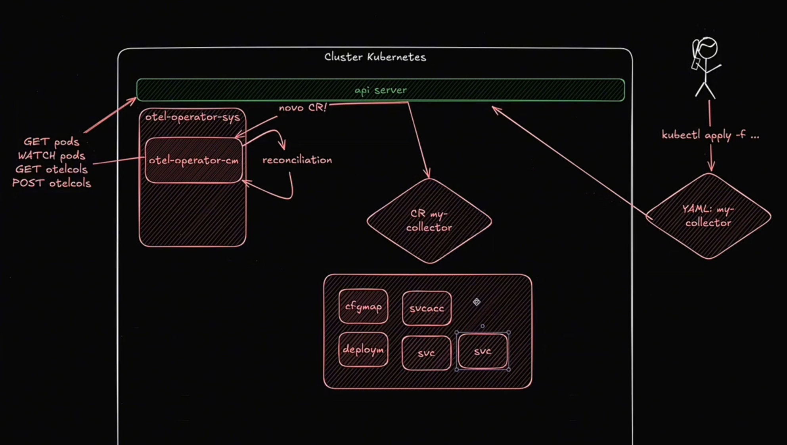

### Instalação

Neste vídeo, mostrei como realizar a instalação do OpenTelemetry Operator em um cluster Kubernetes. Usei um ambiente local com K3D, mas as instruções funcionam da mesma forma em ambientes como Minikube, GKE, AKS e outros. A única exceção mencionada foi o OpenShift, que conta com o Operator Hub, permitindo instalar o operador diretamente por uma interface gráfica, seja na versão da Red Hat ou na versão comunitária.

Na instalação manual, utilizei o repositório oficial do projeto, aplicando os manifests YAML para instalar o Operator e suas dependências. Embora o uso do Cert Manager seja opcional, adicionei ele para facilitar a criação e o gerenciamento de certificados usados pelos webhooks. Mostrei passo a passo como aplicar os arquivos, acompanhar o status dos deployments e verificar a criação de CRDs, roles, webhooks e service accounts no cluster.

Após a instalação, validei o funcionamento criando uma CR do tipo OpenTelemetryCollector. Com ela, o operador provisionou automaticamente os objetos necessários, como ConfigMap e Deployment, e completou a configuração com padrões adequados ao ambiente Kubernetes — como o uso de 0.0.0.0 no receiver em vez do 127.0.0.1 padrão. Esse ajuste garante que o Collector esteja acessível dentro do cluster. Encerramos com o Operator pronto para receber outras CRs e gerenciar a observabilidade de forma declarativa.

Usando um Operator você coloca tudo que você quiser em um só arquivo no Operator. Como instalar:

- Instalar Cert-Manager: `kubectl apply -f https://github.com/cert-manager/cert-manager/releases/download/v1.18.2/cert-manager.yaml`
- Instalar Operator: `kubectl apply -f https://github.com/open-telemetry/opentelemetry-operator/releases/latest/download/opentelemetry-operator.yaml`
- Dar o Apply no Collector: `kubectl apply -f otelcol-cr.yaml`. otelcol-cr.yaml:

  ```
  apiVersion: opentelemetry.io/v1beta1
  kind: OpenTelemetryCollector
  metadata:
    name: otelcol-to-lgtm
  spec:
    image: ghcr.io/open-telemetry/opentelemetry-collector-releases/opentelemetry-collector-contrib:0.124.1
    mode: sidecar
    config:
      receivers:
        otlp:
          protocols:
            grpc: {}
      exporters:
        otlphttp:
          endpoint: http://lgtm.lgtm.svc.cluster.local:4318

      service:
        pipelines:
          traces:
            receivers:  [ otlp ]
            processors: [  ]
            exporters:  [ otlphttp ]
          logs:
            receivers:  [ otlp ]
            processors: [  ]
            exporters:  [ otlphttp ]
          metrics:
            receivers:  [ otlp ]
            processors: [  ]
            exporters:  [ otlphttp ]
  ```

### CRD

CRD seria a classe enquando CR seria o Objeto, se estivessemos falandod e JAVA.

CRD (Custom Resource Definition)

É a definição ou esquema de um novo tipo de recurso personalizado
Define a estrutura, campos, validações e comportamentos que o recurso customizado deve ter
É como um "molde" ou "template" que especifica como o recurso deve ser criado
No contexto do OpenTelemetry Operator, os CRDs definem recursos como OpenTelemetryCollector, Instrumentation, etc.

CR (Custom Resource)

É uma instância específica criada a partir de um CRD
É o recurso real em execução no cluster
Contém os valores e configurações específicas para aquela implementação particular

CRD - Define o tipo de recurso:

```
apiVersion: apiextensions.k8s.io/v1
kind: CustomResourceDefinition
metadata:
  name: opentelemetrycollectors.opentelemetry.io
spec:
  group: opentelemetry.io
  versions:
  - name: v1alpha1
    # Define campos como spec, status, etc.
```

CR - Instância real do coletor:

```
apiVersion: opentelemetry.io/v1alpha1
kind: OpenTelemetryCollector
metadata:
  name: my-collector
spec:
  config: |
    receivers:
      otlp:
        protocols:
          grpc:
            endpoint: 0.0.0.0:4317
```

### Modos de operação dos Collectors

Nós temos 4 modos de operação do Collector no Kubernetes:

- Deployment: você deve usar deployment quando você quer um escalonamento horizontal dos seus collectors, você não quer que os collectors fiquem limitados a quantidade de nodes.
- DaemonSet: você quer que exista um collector por node.
- StatefulSet: ele gera nomes previsiveis pros pods. Não é muito utilizado este modo.
- Sidecar: cada aplicação tem seu próprio collector.

Exemplo da arquitetura de um Sidecar:

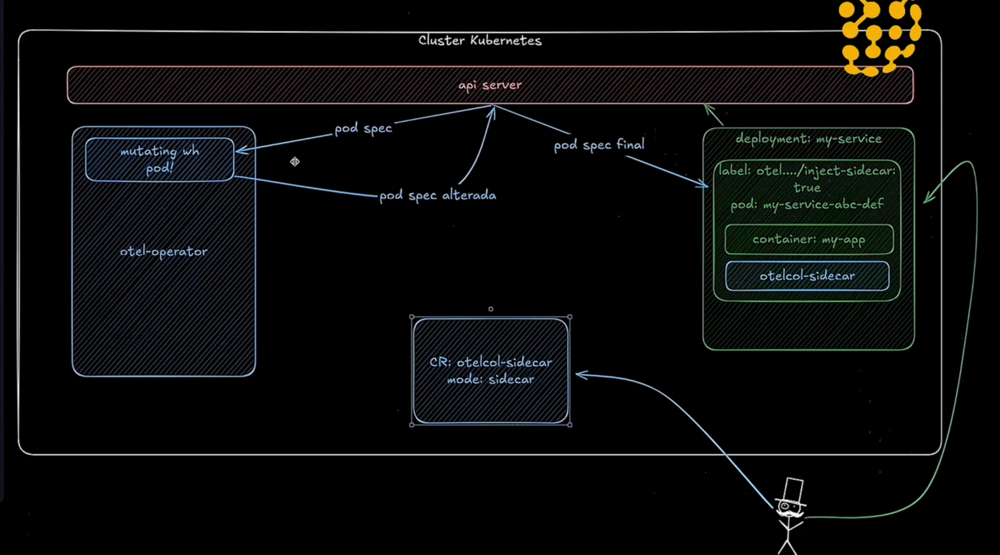

Se quiser executar basta fazer: `kubectl apply -f sidecar-workload.yaml`

### Auto instrumentação

Neste vídeo, apresentei como funciona a CRD de auto-instrumentação do OpenTelemetry Operator e como ela se integra ao Kubernetes. Ao definir uma Custom Resource (CR) de Instrumentation, é possível configurar a auto-instrumentação de workloads com base em anotações no pod template. Usei o exemplo do Keycloak para mostrar esse processo. A lógica envolve um initContainer que copia o agent.jar para um volume compartilhado no pod e configura automaticamente a variável de ambiente necessária para que a JVM carregue esse agente na inicialização.

Mostrei como a anotação nos pods ativa a auto-instrumentação. O Operator intercepta o processo de criação dos pods com um mutating webhook, insere o initContainer no pod e garante que o agente seja referenciado pela variável JAVA_TOOL_OPTIONS. Com isso, o agente é carregado sem necessidade de alterar a imagem da aplicação. Esse mecanismo é robusto e permite aplicar a instrumentação em diversos serviços, mantendo o processo simples e reutilizável.

Por fim, validei o funcionamento observando a instalação do Collector, do LGTM e do próprio Keycloak. Verifiquei os pods, volumes e variáveis de ambiente, garantindo que os rastros estavam sendo enviados corretamente para o backend configurado. Após ajustes no namespace, confirmei que os dados começaram a aparecer no painel. Todo o processo foi concluído com sucesso, provando que a auto-instrumentação estava funcionando como esperado.

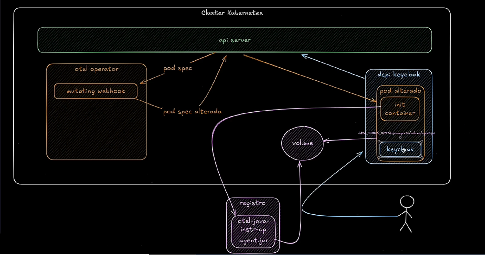

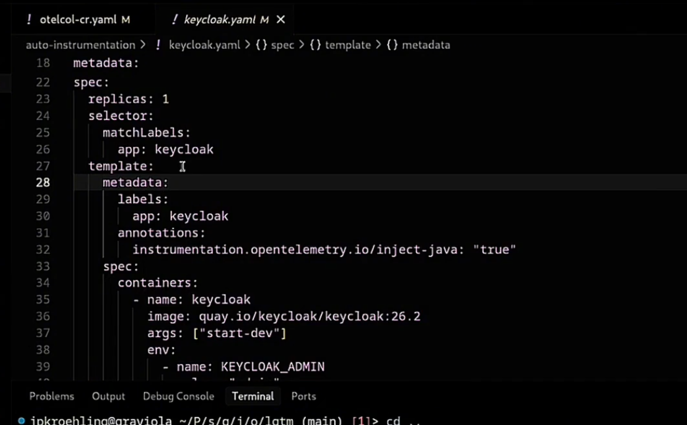

### Target Allocator - Usado com Prometheus

Neste vídeo, mostrei como funciona o Target Allocator e em quais cenários ele realmente se aplica. Ele resolve um problema específico: quando temos milhares ou dezenas de milhares de endpoints Prometheus expostos no Kubernetes e o Prometheus tradicional começa a atingir seus limites de escalabilidade. Em situações como essa, é preciso distribuir a responsabilidade de raspagem entre múltiplas instâncias de Collector, e é aí que o Target Allocator entra como solução de balanceamento automático dos alvos.

Demonstrei a arquitetura completa com exemplos práticos, partindo de workloads com centenas ou milhares de réplicas instrumentadas, passando pela configuração de Service Monitors, até a instalação do Target Allocator e dos Collectors. Mostrei que, ao habilitarmos o targetAllocator em uma CR de Collector, ele assume o papel de Service Discovery e atribui alvos dinamicamente para cada instância. Isso garante que nenhum Collector fique sobrecarregado e que a distribuição seja consistente e automática com base em hashing.

Também fiz uma análise crítica sobre os desafios práticos. Embora o Target Allocator funcione bem para cenários padrão ("arroz com feijão"), sua documentação é limitada e ele não é tão bem mantido atualmente. Casos mais avançados ou configurações fora do comum podem exigir leitura de código e contribuição ativa na comunidade. Ainda assim, para ambientes com grande volume de métricas Prometheus dentro do Kubernetes, ele continua sendo uma solução válida e eficiente.

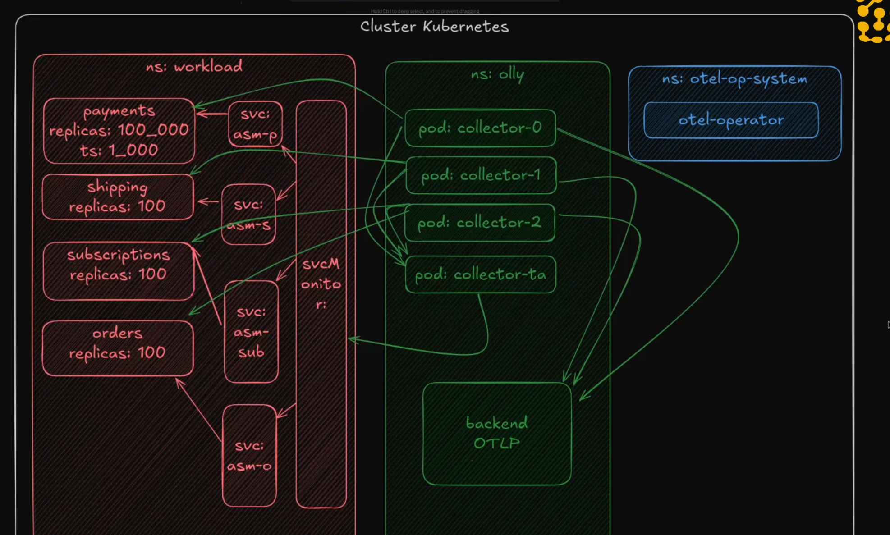

# OpAMP

Pause
Mute
Remaining Time

- 22:29
  Captions
  1x
  Playback Rate
  Fullscreen
  Este módulo apresenta o OpAMP (Open Agent Management Protocol), um protocolo aberto criado dentro do projeto OpenTelemetry para permitir que um servidor central gerencie remotamente uma frota de agentes, como os OpenTelemetry Collectors. A comunicação é definida por uma especificação baseada em Protobuf, que estabelece as mensagens trocadas entre o agente e o servidor. Apesar de a especificação já ser considerada estável, é importante notar que o ecossistema OpAMP ainda está em desenvolvimento e, no momento, não existe uma implementação de servidor que seja totalmente de código aberto e neutra de fornecedor, o que limita seu uso em produção sem recorrer a soluções comerciais.

A arquitetura típica do OpAMP envolve três componentes principais: o Servidor, que é a central de gerenciamento; o Agente, que é o Collector a ser gerenciado; e um Supervisor, que atua como intermediário. Como o Collector não foi projetado para recarregar configurações dinamicamente ("hot reload"), o Supervisor recebe os comandos do Servidor e é responsável por parar o Collector, aplicar a nova configuração e reiniciá-lo. Em ambientes Kubernetes, o OpenTelemetry Operator pode funcionar como esse Supervisor através de um componente "ponte" (bridge), traduzindo os comandos do OpAMP em alterações nos recursos do Kubernetes, como os ConfigMaps e as definições dos Collectors.

O protocolo OpAMP define diversas capacidades, como a habilidade de um agente reportar seu estado de saúde, sua configuração e os componentes que possui, além da capacidade de o servidor enviar novas configurações ou até mesmo pacotes de atualização para o binário do agente. Essa capacidade de atualização remota dos binários gera uma discussão sobre a melhor abordagem de deployment, contrastando um modelo de agentes autônomos com a filosofia GitOps, onde a preferência é por infraestrutura imutável e rollouts controlados. A abordagem GitOps, que cria novas instâncias com as alterações em vez de modificar as existentes, é apresentada como uma prática mais segura e previsível para gerenciar as configurações dos Collector

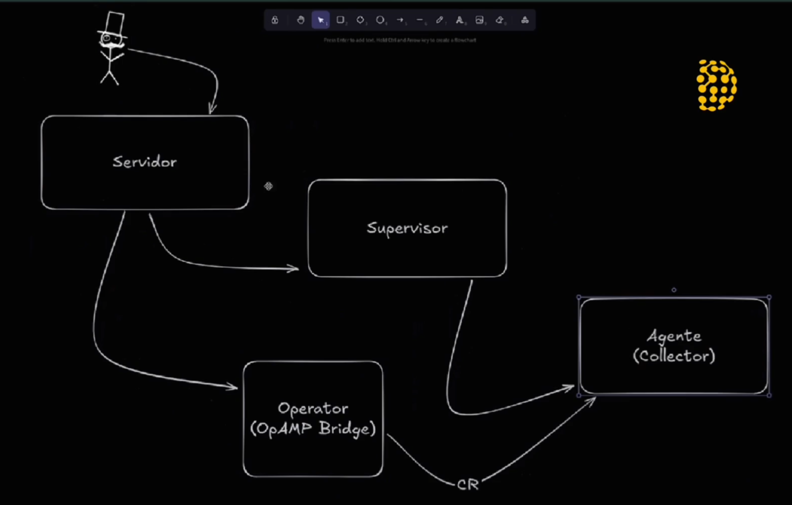

# Arquitetura

## Instrumentações

Este módulo aborda a arquitetura de uma configuração do OpenTelemetry, enfatizando que a instrumentação deve começar com um propósito claro, definido pelos Objetivos de Nível de Serviço (SLOs) do seu sistema. A estrutura do OpenTelemetry é dividida em camadas: a instrumentação na aplicação (com API e SDK), os componentes de auto-instrumentação (via bibliotecas, eBPF), e a camada intermediária com Collectors. Esses Collectors recebem dados de telemetria (rastros, métricas e logs) dos microsserviços e os encaminham para um backend, que é responsável pelo armazenamento, visualização e criação de alertas, tarefas que estão fora do escopo do OpenTelemetry.

Para garantir a consistência e a qualidade dos dados, a equipe de engenharia de observabilidade deve liderar a criação de padrões. Isso envolve o desenvolvimento de um "framework dourado" ou "imagem dourada" que as equipes de engenharia de software possam adotar, garantindo que boas práticas de instrumentação e resiliência (SRE) sejam incorporadas de forma padronizada. Além disso, é crucial estabelecer e documentar convenções semânticas internas que complementem as do OpenTelemetry, definindo como atributos específicos do negócio (como tenant.id) devem ser nomeados e aplicados em todos os sinais de telemetria.

A estratégia de longo prazo deve focar na geração de telemetria de alta qualidade, em vez de simplesmente coletar o máximo de dados possível com a auto-instrumentação genérica. Utilizar a auto-instrumentação como uma solução permanente pode levar a dados de baixa qualidade, altos custos de observabilidade e um baixo retorno sobre o investimento. Uma instrumentação proposital e de alta qualidade facilita a depuração de problemas, reduz os custos operacionais e com o provedor de observabilidade, e torna as informações mais úteis e acessíveis quando necessário.

## Arquitetura na Pipeline

Neste módulo, eu exploro a arquitetura da pipeline de telemetria em ambientes nativos para a nuvem, com foco em Kubernetes. Falo sobre os dois padrões principais para coleta inicial: o uso do Collector como sidecar, executando no mesmo pod da aplicação — o que oferece isolamento, mas consome mais recursos e exige reinício do pod para atualizações — e o modelo baseado em DaemonSet, com um único Collector por nó atendendo múltiplos pods. A escolha entre eles envolve trade-offs importantes entre performance, custo e resiliência.

Também abordo como essa arquitetura pode evoluir para incluir múltiplas camadas de Collectors. Começo com um cenário mais simples, onde os dados fluem diretamente das aplicações para uma camada de Collectors dedicada, com balanceamento de carga nativo do Kubernetes. Em seguida, exploro casos que exigem processamento stateful, como tail sampling, onde todos os spans de um mesmo trace precisam ser roteados de forma consistente. Para isso, é necessário usar uma primeira camada de Collectors como balanceadores inteligentes via load_balancing_exporter, encaminhando os dados para uma segunda camada responsável pelo processamento.

Para ambientes com múltiplos clusters, apresento dois modelos arquiteturais: o descentralizado, onde cada cluster mantém sua própria stack de observabilidade; e o centralizado, no qual os dados são processados localmente antes de serem enviados para um cluster observabilidade único. Também discuto estratégias de retenção de dados, como manter spans brutos por um curto período para depuração imediata e armazenar dados amostrados de alto valor por mais tempo. Essa abordagem garante escalabilidade, controle de custo e visibilidade de ponta a ponta.

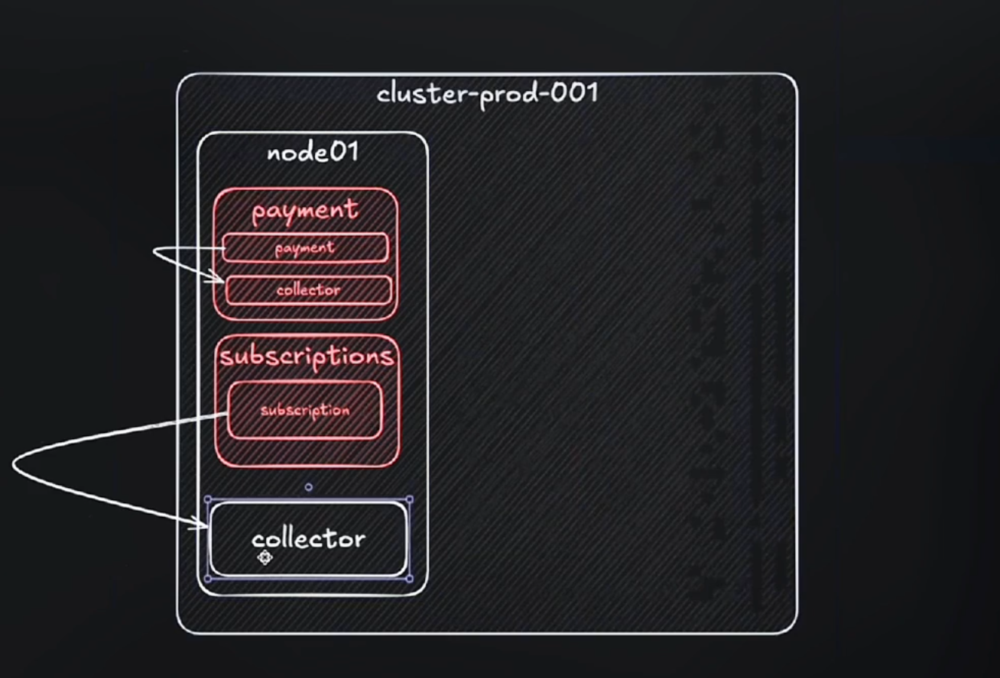

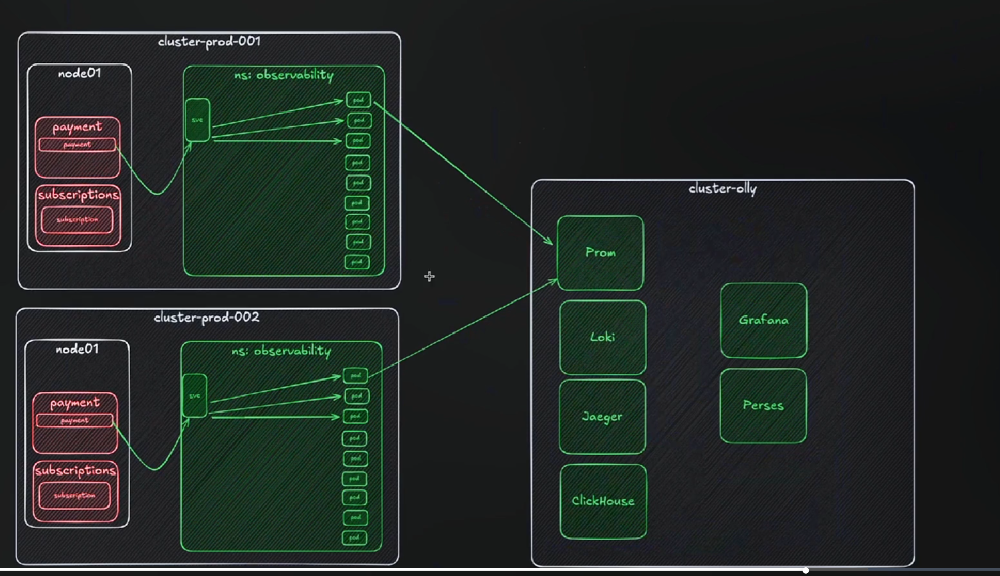

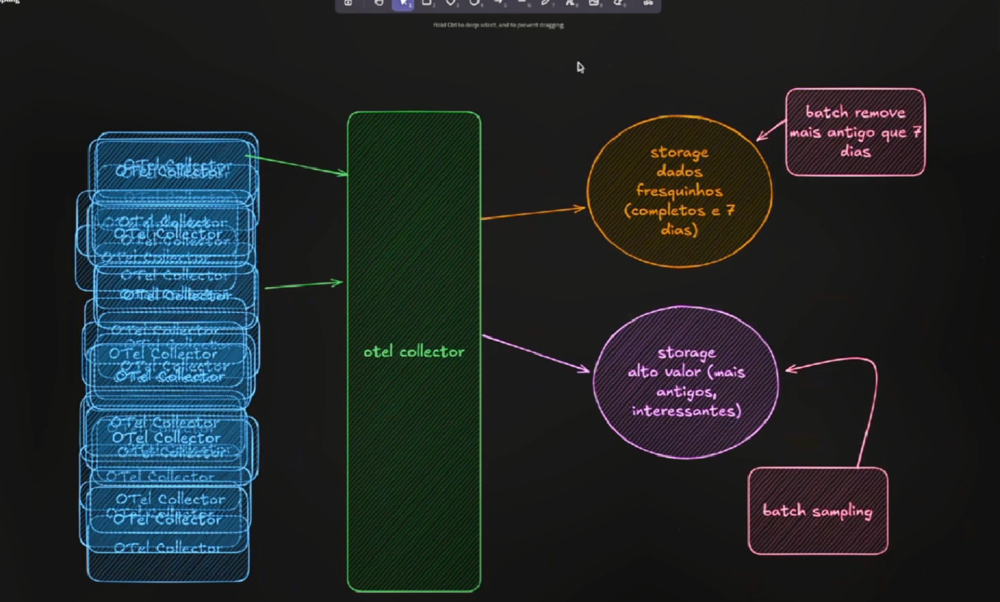

# Migração

A transição para o OpenTelemetry é um passo estratégico que exige um planejamento cuidadoso, indo além de uma simples troca de ferramentas. O ponto de partida para qualquer migração bem-sucedida é a definição clara dos objetivos, seja para obter independência de fornecedores, otimizar custos ou padronizar a observabilidade em toda a organização. Entender o "porquê" da migração é fundamental para alinhar as equipes e justificar o investimento de tempo e recursos, garantindo que o esforço esteja direcionado para a solução de problemas concretos e a geração de valor para o negócio.

O processo de migração apresenta desafios significativos que precisam ser gerenciados. Entre eles, destacam-se a complexidade de alterar sistemas em produção sem causar interrupções, a necessidade de capacitar as equipes com novas ferramentas e conceitos, e a gestão de diferentes formatos e semânticas de dados entre o sistema legado e o novo padrão OpenTelemetry. A arquitetura do OpenTelemetry, especialmente o uso do Collector, desempenha um papel central ao atuar como um intermediário que recebe, processa e distribui dados de telemetria para múltiplos destinos, permitindo uma transição controlada e gradual.

Para garantir o sucesso, a abordagem recomendada é dividir o problema complexo em partes menores e gerenciáveis. A estratégia consiste em iniciar a migração com um único serviço ou um conjunto limitado de aplicações, utilizando essa experiência inicial como um projeto piloto para aprender, documentar os desafios e validar a nova arquitetura. Esse método iterativo permite que a equipe ganhe confiança e conhecimento, crie automações e desenvolva um plano de ação replicável para os demais serviços, assegurando uma migração mais segura e eficiente em larga escala.

Se atentar com:

- Analisar os motivos e quais são seus objetivos ao migrar para OTLP, por que seria importante usar o OTLP ?
- Passagem de conhecimento entre as equipes ou realizar treinamentos
- Instrumentar a aplicação para enviar os dados para dois locais diferentes em um primeiro momento
- Dados que estão sendo usadas
- Verificar qual o backend que será utilizado para receber os dados
- Dependendo do volume de dados gerenciar os Collectors pode ser um desafio ao longo prazo
- Problemas com a instrumentação da aplicação
- Migração leva de 6 a 12 meses

ANTES

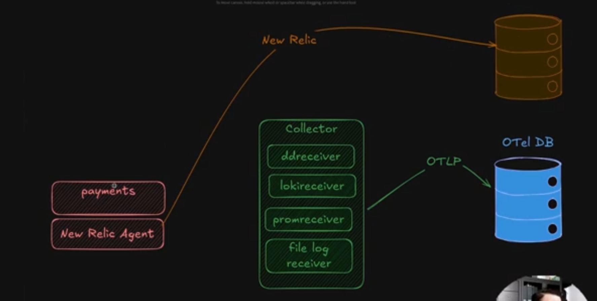

DEPOIS

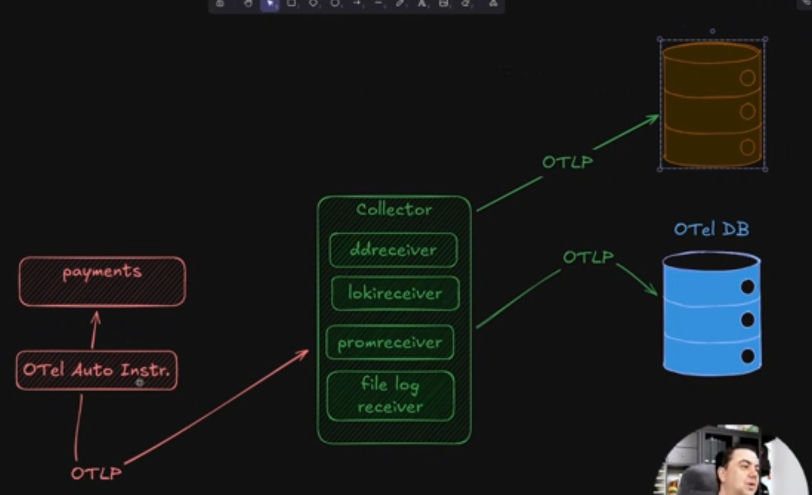

# Cultura de Observabilidade

A implementação bem-sucedida de uma cultura de observabilidade depende de uma equipe central, frequentemente chamada de Engenharia de Observabilidade. Embora nem toda empresa tenha uma equipe com este nome, a responsabilidade recai sobre profissionais que possuem um conhecimento híbrido de engenharia de software, operações e SRE. Estes especialistas dominam ferramentas como OpenTelemetry e Prometheus e são responsáveis por arquitetar a pipeline de telemetria, escolher as soluções de observabilidade e, crucialmente, educar a organização. Para ter sucesso, essa equipe precisa não apenas de conhecimento técnico, mas também de habilidades sociais para criar conteúdo e disseminar o conhecimento pela empresa.

A melhor estratégia para disseminar a cultura de observabilidade é começar pequeno, quebrando o problema em partes menores. A abordagem inicial consiste em selecionar uma equipe piloto, idealmente uma que já enfrente problemas recorrentes em produção, pois é a que mais se beneficiará da observabilidade. Um engenheiro de observabilidade deve trabalhar lado a lado com um "campeão" dentro dessa equipe, ensinando-o a instrumentar, visualizar dados, criar alertas e usar essas informações para resolver problemas reais. O sucesso deste piloto cria um caso de estudo e transforma os membros da equipe em defensores da observabilidade, ajudando a convencer outras equipes a adotarem as mesmas práticas.

Para escalar a adoção, é preciso ir além dos pilotos. Uma técnica eficaz é a realização de "Game Days", dias de jogos em que as equipes praticam a resolução de falhas em um ambiente controlado e de baixo estresse, como foi feito na Skyscanner. Outro pilar fundamental é a documentação robusta e a automação, provisionando novos serviços com um conjunto básico de dashboards e alertas automaticamente. É crucial evitar uma implementação forçada e em larga escala, pois a falta de preparo pode levar a uma instrumentação incorreta, custos elevados e à frustração das equipes, prejudicando a cultura. O caminho para o sucesso é gradual, baseado em educação, prática e na criação de sucessos internos que se propagam organicamente pela organização.

- Colocar dias que os times façam uma brincadeira, que seria a implementação de alguma aplicação com problema e eles teriam que utilizar da observabilidade para encontrar o que está causando o problema.
